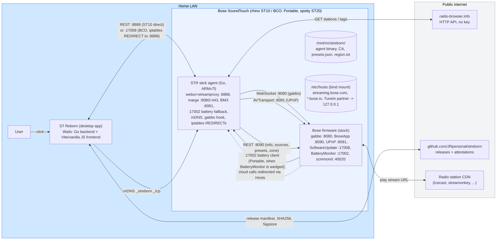
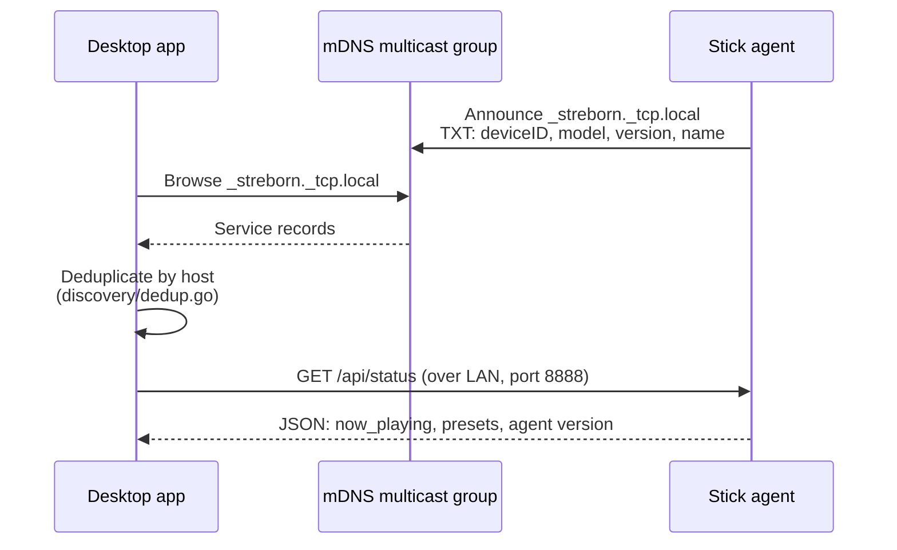
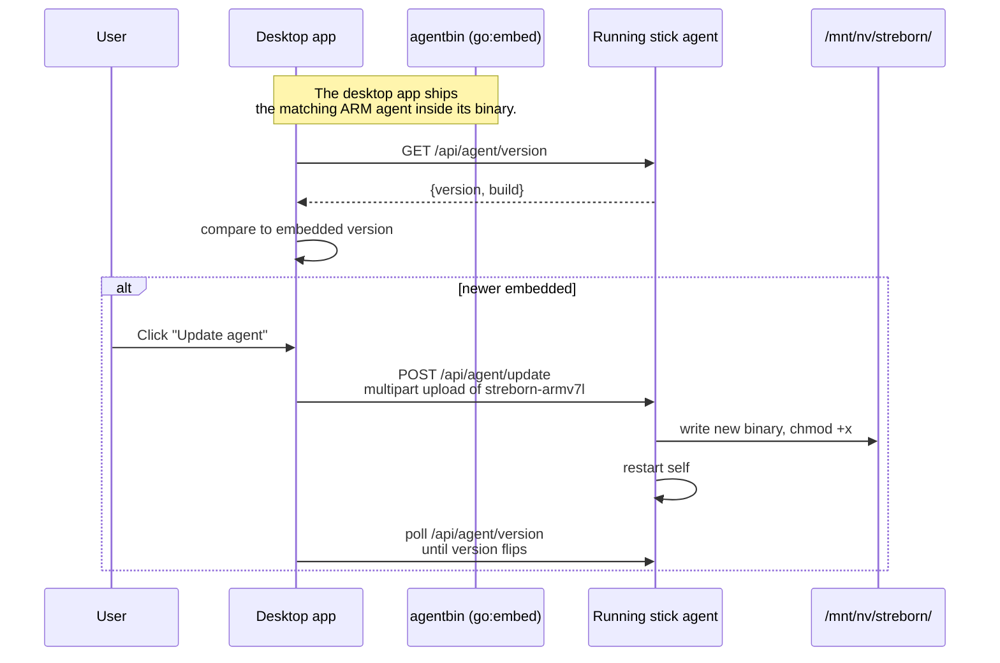

# STR Architecture

Pre-flight reading for anyone who wants to contribute, audit, or
understand how the parts of STR fit together. This document does not
repeat the project pitch (see [`README.md`](../README.md)) or the
threat model (see [`THREAT-MODEL.md`](./THREAT-MODEL.md)). It focuses
on **components, tech stack, and data flow**.

## Big picture



The blue area is everything that survives without the public
internet. Once the agent is installed, the speaker plays radio fully
locally; the only outbound call is the upstream CDN serving the
station's audio bytes.

## Components

| Component | Lives in | Runtime | Job |
|---|---|---|---|
| **Stick agent** | `cmd/agent/`, `internal/` | Go binary on the speaker NAND, started by `/mnt/nv/streborn/run-override.sh` from Bose `rc.local` | Emulates the Bose cloud (marge, BMX), proxies radio streams, owns the preset store, announces over mDNS, hooks the speaker's WebSocket bus to re-enable hardware preset buttons. On BCO boxes it also installs the iptables PREROUTING REDIRECTs that make it LAN-reachable, and serves the `:17002` BatteryMonitor fallback on the Portable. |
| **Desktop app** | `desktop-app/` | Wails app (Go backend + Vite frontend), built for Windows, macOS, Linux | Discovers agents over mDNS, talks to them by REST, ships a UI for radio search, presets, playback, settings, OTA agent updates, USB stick provisioning. |
| **Setup wizard** | `setup/`, `sticksetup/`, `cmd/winformat/` | PowerShell scripts + embedded helper `winformat.exe` | Prepares a FAT32 USB stick with Wi-Fi credentials, region, friendly name, and the bootstrap shell scripts. Wraps the in-app install button. |
| **USB stick filesystem** | `usb-stick/` | Files written to a FAT32 stick by the wizard | Boot-time bootstrap (`rc.local`, `run.sh`, `install.sh`), one-shot config (`wlan.conf`, `name.txt`, `region.txt`, `presets.json`), the agent binary itself. |
| **mDNS discovery** | `discovery/` (top level on purpose, see `CLAUDE.md`) | Imported by both the agent and the desktop app | Service type `_streborn._tcp.local`. TXT record carries deviceID, model, friendly name, version. |
| **Website** | separate repo `JRpersonal/streborn-website` | Astro static site, EN and DE | Downloads, FAQ, Verify page with SHA256 and Sigstore click-paths, legal pages. Built on `repository_dispatch` from this repo's release workflow. |

## Tech stack

| Layer | Choice | Why |
|---|---|---|
| Stick agent language | Go 1.22+ (module `github.com/JRpersonal/streborn`) | Static single binary cross-compiles to `linux/arm/v7` from any host. No runtime on the speaker beyond BusyBox. |
| Desktop backend | Go via Wails v2 (`github.com/wailsapp/wails/v2`) | Same language as the agent, can import `discovery/` and `internal/boxapi` for free. |
| Desktop frontend | Vite 6 + vanilla JS (no framework), i18n layer (EN, DE, FR, ES, JA, UK, NL, PL) | Keeps the binary small and the build chain dependency-light. No React/Vue tax for the UI. |
| mDNS | `github.com/grandcat/zeroconf` | Pure Go, dual stack, works on all three desktop OSes and on the speaker. |
| WebSocket | `github.com/gorilla/websocket` | Reuses the gabbo subprotocol the Bose firmware expects on `:8080`. |
| Radio source | `radio-browser.info` HTTP API | Free, no key, community-maintained. Replaces the dead Bose TuneIn integration. |
| Setup wizard host script | PowerShell 5.1 on Windows | Ships with every Windows; no Python install required for the user. |
| FAT32 helper | Custom Go tool (`cmd/winformat`) | Avoids elevation prompts and shell quoting around `diskutil` / `format`. |
| Installers | InnoSetup (Windows), `.dmg` via Wails (macOS), AppImage (Linux) | Standard per-platform distribution, no exotic dependencies. |
| CI | GitHub Actions, all actions SHA-pinned | Build provenance via Sigstore (`actions/attest-build-provenance`). |
| Verification | SHA256 + Sigstore today; code signing deferred on cost (see #72) | Verify page documents the click-paths through SmartScreen and Gatekeeper. |

## Network ports

### On the speaker (when STR is running)

STR's own ports are bound on loopback and the LAN interface; the Bose
firmware ports are stock. On the newer **BCO** chassis (Portable/taigan,
spotty ST20) the network chipset accepts inbound external TCP only to
listeners owned by a Bose binary, so STR's own ports are **not** reachable
from the LAN directly. STR therefore installs iptables PREROUTING
`REDIRECT` rules that map a Bose-owned external port onto the loopback STR
listener. On Series-I ST10 (rhino) the STR ports are reachable directly.

| Port | Listener | Role | LAN reachable |
|---|---|---|---|
| 22 | sshd (Bose) | Open only while the stick is inserted; closed once it is unmounted. | stick only |
| 80 | PtsServer (Bose) | Internal Bose endpoint; the firmware's outbound :80 cloud calls are NAT-redirected to STR's :9080. | internal |
| 443 | STR marge HTTPS | TLS cloud-stub for `streaming.bose.com` after the Hosts redirect. | loopback (firmware) |
| 7000 | STSCertified (Bose) | TLS endpoint inside the firmware. Untouched. | internal |
| 8080 | WebServer / gabbo (Bose) | Hosts the `/gabbo` WebSocket bus. STR connects as a client. | internal |
| 8081 | STR BMX stub | Cloud-stub for `content.api.bose.io`. | via :8081 REDIRECT (BCO) |
| 8090 | BoseApp (Bose) | REST: `/info`, `/now_playing`, `/presets`, `/select`, `/volume`, zones, ... STR reads and writes here. | internal |
| 8091 | UPnP AVTransport (Bose) | STR sets the stream URL via SetURI; the speaker fetches and decodes. | internal |
| 8443 | STR marge HTTPS (alt) | Same handler as :443; used when :443 cannot be claimed. | via :8443 REDIRECT (BCO) |
| 8888 | STR webui + streamproxy | `/api/*` for the desktop app + the `/stream/<slot>` reverse proxy that survives CDN token expiry. | direct (ST10) / via :17008 REDIRECT (BCO) |
| 9080 | STR marge HTTP | Plain-text marge target after the firmware's outbound :80 is NAT-redirected. | via :9080 REDIRECT (BCO) |
| 17002 | STR BatteryMonitor fallback | **Portable only.** Bound when the Bose `BatteryMonitor` service is wedged, so BoseApp's battery client connects instead of connect-storming a dead port. This is the ~27 min reboot fix (v0.6.18); see [`FIRMWARE-NOTES.md`](./FIRMWARE-NOTES.md). | loopback (firmware) |
| 17008 | SoftwareUpdate (Bose) | On BCO this is STR's external entry point: the PREROUTING REDIRECT sends external :17008 to loopback :8888, which is how the desktop app reaches the agent. | external entry (BCO) |
| 40020 | scmmond (Bose) | System-control / battery-MCU manager that feeds `BatteryMonitor`. STR does not bind it. | internal |

**How the desktop app reaches the agent:** mDNS advertises the agent on
`:8888`, but on BCO boxes that port is not externally reachable, so the app
probes and uses the **verified-reachable** port (`:17008` on BCO, `:8888`
on ST10). `:9080` is the production marge HTTP port; `--listen-marge :80`
in `cmd/agent` is a test default only.

### On the desktop app host

The desktop app does not listen on any port. It only initiates
connections over the LAN.

## Communication flows

### 1. LAN discovery



Agents are also picked up as legacy `_soundtouchstick._tcp` so old
sticks built before the rename keep working.

### 2. Radio search and playback

```mermaid
sequenceDiagram
  participant User
  participant App as Desktop app
  participant Agent as Stick agent
  participant RB as radio-browser.info
  participant SP as STR streamproxy
  participant Box as Bose firmware
  User->>App: Type query "1live"
  App->>Agent: GET /api/radio/search?q=1live
  Agent->>RB: HTTPS GET /stations/search
  RB-->>Agent: JSON, ranked by votes
  Agent-->>App: stations[]
  User->>App: Click play
  App->>Agent: POST /api/play {url, name, icon}
  Agent->>Box: SetURI on :8091 with<br/>http://127.0.0.1:8888/stream/raw?u=<b64>
  Box->>SP: GET /stream/raw?u=<b64>
  SP->>UpstreamCDN: Follow redirects, stream bytes
  UpstreamCDN-->>SP: audio/mpeg
  SP-->>Box: audio/mpeg<br/>(reconnect on EOF without dropping Box's TCP)
  Box-->>User: Audio out
```

The streamproxy on `:8888` is the load-bearing mechanism: the speaker
sees a stable `http://127.0.0.1:8888/stream/<slot>` URL forever, while
the agent internally handles CDN token expiry and reconnects without
the speaker noticing.

### 3. Hardware preset button (short press)

```mermaid
sequenceDiagram
  participant User
  participant Box as Bose firmware
  participant WS as ws://127.0.0.1:8080/gabbo
  participant Agent as STR boxws hook
  participant SP as STR streamproxy
  User->>Box: Press preset 2
  Box->>WS: <updates><nowSelectionUpdated><preset id="2">...
  WS-->>Agent: XML frame
  Agent->>Agent: parse, slot=2,<br/>read presets.json
  Agent->>Box: AVTransport SetURI on :8091<br/>http://127.0.0.1:8888/stream/2
  Box->>SP: GET /stream/2
  SP-->>Box: audio bytes
  Box-->>User: Plays slot 2
```

Long-press save is firmware-bound and does not emit a WebSocket
frame, so STR cannot hook it. See issue #69 for the live capture
that proved this and the INTERNET_RADIO re-sourcing path that would
unblock it.

### 4. Marge: local cloud stand-in

```mermaid
sequenceDiagram
  participant Box as Bose STSCertified
  participant Hosts as /etc/hosts (bind mount)
  participant Iptables as iptables NAT
  participant Marge as STR marge stub
  Note over Hosts: streaming.bose.com -> 127.0.0.1<br/>*.api.bose.io -> 127.0.0.1<br/>TuneIn partner -> 127.0.0.1
  Box->>Hosts: resolve streaming.bose.com
  Hosts-->>Box: 127.0.0.1
  alt HTTPS request
    Box->>Marge: TLS connect :443<br/>(STR CA installed in box trust store)
    Marge-->>Box: HTTP 200 + spy log entry
  else HTTP request
    Box->>Iptables: TCP :80
    Iptables->>Marge: redirected to :9080
    Marge-->>Box: HTTP 200 + spy log entry
  end
  Marge->>Marge: log to /__spy/log<br/>respond with minimal stub<br/>(power_on, sourceProviders, addDevice, ...)
```

Marge's strategy is not "implement the full Bose cloud" but "respond
with the minimum the firmware accepts as 'cloud reachable, nothing
to do'". The spy log is the development tool that drives which
endpoints get real responses next; everything else gets a generic
`<ack/>` so the firmware does not retry.

### 5. First install (USB stick)

```mermaid
sequenceDiagram
  participant User
  participant Wizard as Setup wizard (PowerShell)
  participant Stick as USB stick (FAT32)
  participant Box as Speaker (cold boot)
  participant NAND as /mnt/nv/streborn/
  User->>Wizard: Run STReborn-Setup.exe<br/>pick speaker, Wi-Fi, name
  Wizard->>Stick: winformat.exe (FAT32)<br/>write run.sh, install.sh,<br/>streborn-armv7l, wlan.conf,<br/>name.txt, region.txt, remote_services
  User->>Box: Insert stick, power on
  Box->>Stick: Bose rc.local sees remote_services<br/>opens sshd, mounts /media/sda1
  Box->>Box: /media/sda1/rc.local runs run.sh
  Box->>NAND: copy run-override.sh + agent binary
  Box->>Box: WLAN provisioning (Approach B:<br/>POST /addWirelessProfile on :8090)
  Box->>Box: Start agent
  User->>Box: Remove stick after first boot
  Note over Box: From now on, NAND override starts<br/>the agent on every boot. No stick needed.
```

The stick is **recovery media**, not a runtime requirement. See
[`docs/THREAT-MODEL.md`](./THREAT-MODEL.md) for the SSH-while-stick-
inserted window and how it is closed.

### 6. OTA agent update



Build-stamp coupling is critical: the desktop app and the embedded
ARM agent must come from the same release pipeline run, or the
version check loops. See the build-stamp-sync memory and
`Makefile` `wails-build`, which produces both from one checkout.

### 7. Desktop app auto-update check

This is separate from the speaker-agent OTA above: it is the desktop
app checking whether a newer **app** release exists.

```mermaid
sequenceDiagram
  participant App as Desktop app
  participant Web as st-reborn.de/api/update-check.php
  participant GH as GitHub Releases
  Note over App: ~8 s after startup, once (opt-out: STR_NO_UPDATE_CHECK)
  App->>Web: GET update-check?v&b&os&arch&lang
  Web-->>App: {version, assetUrl, sha256, ...}
  App->>App: compare remote version to running
  alt remote is newer
    App->>App: show "update available" banner
    Note over App,GH: today the banner links to the release;<br/>planned (#71): in-app download + sha256 verify + relaunch
  end
```

The check sends only the running version, build stamp, OS, CPU
architecture, and UI locale, so the server can return the right asset
and keep a rough version count. No account, no device ID, no personal
data. It is fully disablable with `STR_NO_UPDATE_CHECK=1`.

The request runs through a dedicated **pure-Go** HTTP client: DNS uses
Go's own resolver and TLS verification uses an embedded CA-root bundle
instead of the platform trust store. On macOS the platform path goes
through cgo (Security.framework) and crashed an old Mac on this very
call; the pure-Go path removes the last cgo dependency from the check.
See `desktop-app/update_tls.go`.

## External dependencies at runtime

| Service | Used by | Required? |
|---|---|---|
| radio-browser.info | Stick agent for `/api/radio/*` | Yes for radio search. Cached locally for already-known stations. No API key, no account. |
| Upstream radio CDNs | Speaker (proxied through the streamproxy) | Yes for actual audio. STR does not host or buffer the stream beyond the in-flight bytes. |
| `st-reborn.de` update-check | Desktop app, once ~8 s after startup | Optional. Sends only version, build, OS, arch, UI locale; opt-out with `STR_NO_UPDATE_CHECK`. See flow 7 above and the privacy section below. |
| Favicon service (`icons.duckduckgo.com`) | Desktop app webview, only when a station tile has no usable logo of its own | Optional, cosmetic. The browser requests a `<domain>.ico` URL to fetch a station's logo. Only the radio station's own public domain is sent, never user data. When DuckDuckGo also has nothing, the fallback is a locally generated letter monogram (a `data:` URI, no network). Google's favicon service is deliberately not used (data mining). See the logo cascade in `desktop-app/frontend/src/logos.js`. |

Bose's own cloud endpoints (`streaming.bose.com`, `*.api.bose.io`,
TuneIn partner URL) are **redirected to localhost** by `/etc/hosts`
and answered by marge. No outbound traffic is needed there.

## Telemetry, analytics, and privacy

STR has no user accounts, no advertising, and no third-party trackers in
the app. The complete picture of what talks to what:

| Component | Talks to | What is sent |
|---|---|---|
| Speaker (agent + firmware) | **Never** the Bose cloud | STR redirects the Bose cloud hostnames to localhost and answers them itself (marge). The speaker only reaches the LAN, radio-browser.info (station search and metadata), and the upstream radio CDN (audio, proxied). |
| Desktop app | `st-reborn.de` update-check, once at startup | Running version, build stamp, OS, CPU arch, UI locale. No account, no device ID, no personal data. Opt-out: `STR_NO_UPDATE_CHECK=1`. Radio and CDN traffic flow through the speaker agent, not the app. |
| Desktop app webview | `icons.duckduckgo.com` | Only a radio station's own domain, to fetch its logo when the station ships no usable artwork. No user data, no account, no identifier. When DuckDuckGo also has nothing, a local letter monogram is drawn with no network call. Google's favicon service was deliberately not used. |
| Website (`st-reborn.de`) | GoatCounter | Privacy-friendly, cookieless page analytics: no cookies, no cross-site tracking, the visitor IP is not stored. |

Bose's own telemetry endpoint (`events.api.bosecm.com`) and software
update endpoint (`worldwide.bose.com`) are likewise redirected to
localhost and answered with a benign `200`, so the speaker emits nothing
to Bose.

## Storage layout on the speaker

```
/mnt/nv/streborn/             persistent across reboots and Bose factory reset
  bin/streborn-armv7l         agent binary
  run-override.sh             NAND copy that takes priority over the stick's run.sh
  ca/                         STR's local TLS CA + server cert (regenerated on first boot)
  presets.json                preset store; same schema as /media/sda1/presets.json
  region.txt                  ISO country code from the setup wizard
  name.txt                    pending box name to apply once
  logs/                       rolling agent logs
  state/                      transient state
  boot.log                    last boot timeline
  version.txt                 installed agent version
```

`/media/sda1/` is the stick mount; the stick is no longer required
after first boot, so its contents are a snapshot of the install-time
configuration plus the agent binary that gets copied into NAND.

## Where to look in the code

| You want to... | Read this |
|---|---|
| ...trace a hardware button press end to end | `internal/boxws/boxws.go`, then `internal/upnp/upnp.go` |
| ...understand the marge cloud emulation | `internal/marge/marge.go` + `templates.go`; check the spy log on `:8081/__spy/log` and `:9080/__spy/log` |
| ...see how presets are stored | `internal/presets/presets.go` |
| ...follow the desktop-app boot | `desktop-app/main.go`, then `desktop-app/frontend/src/main.js` |
| ...inspect the stick boot sequence | `usb-stick/rc.local`, `usb-stick/run.sh`, `usb-stick/install.sh` |
| ...understand discovery semantics | `discovery/` (top level so Wails can import it) |
| ...check the release pipeline | `.github/workflows/release.yml`, `Makefile` (`wails-build`, `agent-embed`) |

## What this document is not

- Not a replacement for `CLAUDE.md`, which is the operating manual
  for working on the repo.
- Not the threat model. That lives in
  [`THREAT-MODEL.md`](./THREAT-MODEL.md).
- Not the user-facing pitch. That lives on
  [st-reborn.de](https://st-reborn.de) and in
  [`README.md`](../README.md).

## Trademark and scope notice

STR is an independent open source project. **Bose** and **SoundTouch**
are registered trademarks of Bose Corporation. STR is **not affiliated
with, endorsed by, sponsored by, or otherwise connected to** Bose
Corporation. References to Bose, SoundTouch, the speaker firmware, or
specific Bose internal endpoints in this document are made nominally
to describe interoperability between STR and the user's already
owned hardware after Bose discontinued its SoundTouch cloud service
in February 2026. No Bose firmware code, binaries, or other Bose
copyrighted material is included or distributed by this project.
Reverse engineering for interoperability is permitted under EU
Directive 2009/24/EC, Article 6, and comparable provisions in other
jurisdictions. See [`README.md`](../README.md) for the full
disclaimer.
