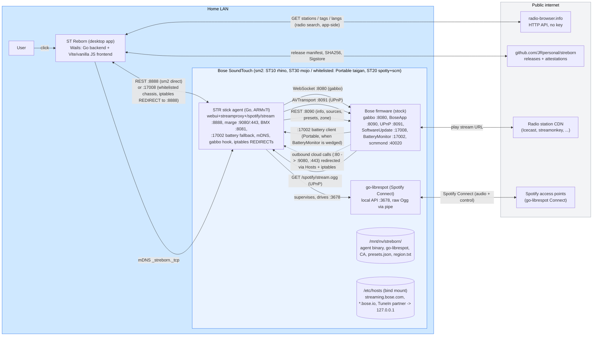
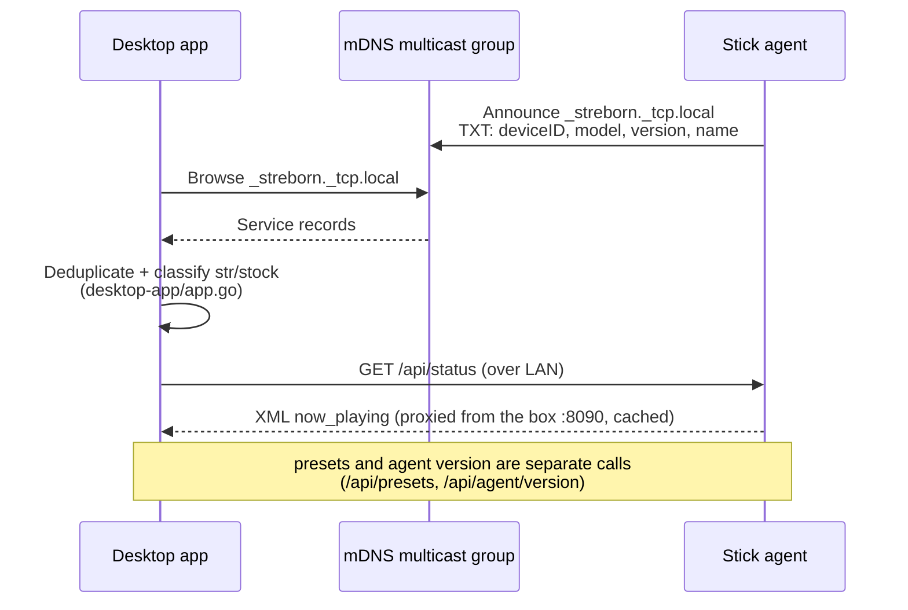

# STR Architecture

Pre-flight reading for anyone who wants to contribute, audit, or
understand how the parts of STR fit together. This document does not
repeat the project pitch (see [`README.md`](../README.md)) or the
threat model (see [`THREAT-MODEL.md`](./THREAT-MODEL.md)). It focuses
on **components, tech stack, and data flow**.

## Big picture



The blue area is everything that survives without the public
internet. Once the agent is installed, the speaker plays radio fully
locally; the only outbound call is the upstream CDN serving the
station's audio bytes.

## Components

| Component | Lives in | Runtime | Job |
|---|---|---|---|
| **Stick agent** | `cmd/agent/`, `internal/` | Go binary on the speaker NAND, started by `/mnt/nv/streborn/run-override.sh` from Bose `rc.local` | Emulates the Bose cloud (marge, BMX), proxies radio streams (incl. HLS conversion), owns the preset store, announces over mDNS, hooks the speaker's WebSocket bus to re-enable hardware preset buttons, manages multiroom zones (NAND `zones.json`, auto-reform), and fires user-configured webhooks on box events (NAND `webhooks.json`). On whitelisted chassis it also installs the iptables PREROUTING REDIRECTs that make it LAN-reachable, and serves the `:17002` BatteryMonitor fallback on the Portable. |
| **Spotify plane (beta)** | `internal/spotify/`, `go-librespot` binary on NAND | go-librespot runs as a Spotify Connect receiver, supervised by the agent's `spotify.Manager` | Spotify Connect on the speaker without the Bose cloud. go-librespot decodes nothing: with the fork's `audio_output_pipe_passthrough` it writes the raw Ogg/Vorbis bitstream to a pipe; the agent serves it at `/spotify/stream.ogg` on :8888 and points the box's UPnP renderer there. Preset recall drives go-librespot's local play API (no token plane). Multi-account is done by swapping credentials + restarting go-librespot (fragile, see fork issue #1). |
| **Desktop app** | `desktop-app/` | Wails app (Go backend + Vite frontend), built for Windows, macOS, Linux | Discovers agents over mDNS, talks to them by REST, ships a UI for radio search (app-side, direct to radio-browser.info), presets, playback (with the live now-playing track + bitrate), a DLNA media library, Spotify Connect (beta), multiroom (alpha), settings, webhooks, diagnostics export, OTA agent updates, USB stick provisioning, and box maintenance (true factory reset, uninstall STR, setup-AP Wi-Fi push). |
| **Local library (DLNA)** | `dlna/` (top level so Wails can import it) | Imported by the desktop app | SSDP discovery + ContentDirectory browse of LAN media servers (FRITZ!Box, Synology, Plex, miniDLNA). The app saves a track's stream URL as a normal preset; the box pulls it via the streamproxy. |
| **Multiroom (alpha)** | `internal/zones/`, `internal/boxapi` zone primitives | Agent endpoints `/api/box/zone` + `/api/box/group` | Groups speakers via the box's native `/setZone` (firmware-synced) or a per-agent mirror fallback, plus stereo pairs. Membership persists in `/mnt/nv/streborn/zones.json` and auto-reforms after reboot/standby/Wi-Fi outage. |
| **Setup wizard** | `sticksetup/`, `cmd/winformat/` (in-app); `setup/` (legacy PowerShell) | Embedded in the desktop app; `winformat.exe` handles FAT32 formatting | Prepares a FAT32 USB stick with Wi-Fi credentials, region, friendly name, language, and the bootstrap shell scripts, then drives the install over SSH. The standalone PowerShell wizard in `setup/` is legacy. |
| **USB stick filesystem** | `usb-stick/` | Files written to a FAT32 stick by the wizard | Boot-time bootstrap (`rc.local`, `run.sh`, `install.sh`), one-shot config (`wlan.conf`, `name.conf`, `region.conf`, `lang.conf`, `presets.json`), `str-shim.so`, `version.txt`, and the agent binary itself. `run.sh` persists name/region to NAND as `name.txt`/`region.txt`. |
| **mDNS discovery** | `discovery/` (top level on purpose, see `CLAUDE.md`) | Imported by both the agent and the desktop app | Service type `_streborn._tcp.local`. TXT record carries deviceID, model, friendly name, version. |
| **Website** | separate repo `JRpersonal/streborn-website` | Astro static site, EN and DE | Downloads, FAQ, Verify page with SHA256 and Sigstore click-paths, legal pages. Built on `repository_dispatch` from this repo's release workflow. |

## Tech stack

| Layer | Choice | Why |
|---|---|---|
| Stick agent language | Go 1.25+ (module `github.com/JRpersonal/streborn`) | Static single binary cross-compiles to `linux/arm/v7` from any host. No runtime on the speaker beyond BusyBox. |
| Desktop backend | Go via Wails v2 (`github.com/wailsapp/wails/v2`); own module, imports the shared top-level packages `discovery/`, `dlna/`, `radiobrowser/`, `sticksetup/`, `wifiprofiles/` | Same language as the agent. Go forbids importing the agent module's `internal/`, which is why the shared packages are top-level. |
| Desktop frontend | Vite 6 + vanilla JS (no framework), i18n layer with 11 locales (EN, DE, ES, FR, JA, LT, LV, NL, PL, TR, UK) | Keeps the binary small and the build chain dependency-light. No React/Vue tax for the UI. |
| mDNS | `github.com/grandcat/zeroconf` | Pure Go, dual stack, works on all three desktop OSes and on the speaker. |
| WebSocket | `github.com/gorilla/websocket` | Reuses the gabbo subprotocol the Bose firmware expects on `:8080`. |
| Radio source | `radio-browser.info` HTTP API | Free, no key, community-maintained. Replaces the dead Bose TuneIn integration. The stream proxy also reads the live ICY `StreamTitle` so the app can show the current track. |
| Spotify | `go-librespot` (fork `JRpersonal/go-librespot`, Ogg passthrough patch) | Open-source Spotify Connect client in Go. Passthrough avoids decoding on the weak ARM CPU: the raw Ogg/Vorbis is handed straight to the box, which decodes it. The passthrough patch is offered upstream as `devgianlu/go-librespot` PR #316. |
| Setup wizard host script | PowerShell 5.1 on Windows | Ships with every Windows; no Python install required for the user. |
| FAT32 helper | Custom Go tool (`cmd/winformat`) | Avoids elevation prompts and shell quoting around `diskutil` / `format`. |
| Distribution | Portable `.exe` + `.zip` (Windows), `.dmg` via `hdiutil` (macOS), `.tar.gz` with a per-user `install.sh` (Linux) | No installer framework; code signing is deferred on cost (#72), so the Verify page documents the SmartScreen/Gatekeeper click-paths instead. |
| CI | GitHub Actions, all actions SHA-pinned | Build provenance via Sigstore (`actions/attest-build-provenance`). |
| Verification | SHA256 + Sigstore today; code signing deferred on cost (see #72) | Verify page documents the click-paths through SmartScreen and Gatekeeper. |

## Network ports

### On the speaker (when STR is running)

STR's own ports are bound on loopback and the LAN interface; the Bose
firmware ports are stock. External reachability splits by chassis:

- **sm2 chassis (ST10 `rhino`, ST30 `mojo`)**: STR's ports are reachable
  directly, but only because `run.sh` punches `INPUT ACCEPT` rules for
  them past the Bose stock firewall (`iptables-setup.sh`).
- **Whitelisted chassis (Portable `taigan`, ST20 `spotty` and `scm`)**:
  the network chipset accepts inbound external TCP only to listeners
  owned by a Bose binary, so STR's own ports are **not** reachable from
  the LAN directly. STR installs an iptables PREROUTING `REDIRECT` that
  maps the Bose-owned external port `:17008` onto the loopback STR
  listener `:8888`. Where NAT is unavailable, an LD_PRELOAD shim on
  `/opt/Bose/SoftwareUpdate` (`usb-stick/shim/shim.c`) is the fallback
  entry path; today the shim is skipped on every catalogued chassis and
  remains only for uncatalogued variants.

| Port | Listener | Role | LAN reachable |
|---|---|---|---|
| 22 | sshd (Bose, started by STR) | **Pre-1.0: open on every boot.** `run.sh` (`ensure_sshd_running`) starts sshd unconditionally and deliberately never stops it, so diagnostics and SSH repair work even when the agent is down. Becomes opt-in via a stick marker as part of the v1.0 hardening (see `THREAT-MODEL.md`). | LAN |
| 80 | _(nobody , firmware OUTBOUND)_ | **Not a listener.** This is the firmware's **outbound** HTTP cloud call (to `streaming.bose.com`). iptables NAT-redirects it to STR's :9080; **STR never binds :80** and the firmware does not listen on it. Listed only because STR claims this outbound traffic. | outbound (firmware) -> redirected to :9080 |
| 443 | STR marge HTTPS | TLS cloud-stub for `streaming.bose.com` after the Hosts redirect. | loopback (firmware) |
| 3678 | go-librespot local API (started by STR) | The agent's `spotify.Manager` drives playback here (`/player/play`, shuffle, next, volume) and reads track events. | loopback |
| 7000 | STSCertified (Bose) | TLS endpoint inside the firmware. Untouched. | internal |
| 8080 | WebServer / gabbo (Bose) | Hosts the `/gabbo` WebSocket bus. STR connects as a client. | internal |
| 8081 | STR BMX stub | Healthz-only placeholder for `content.api.bose.io`; the `/bmx/registry/v1/services` route is answered by marge via the hosts rewrite. | sm2: direct (INPUT ACCEPT) / whitelisted chassis: loopback |
| 8090 | BoseApp (Bose) | REST: `/info`, `/now_playing`, `/presets`, `/select`, `/volume`, zones, ... STR reads and writes here. | internal |
| 8091 | UPnP AVTransport (Bose) | STR sets the stream URL via SetURI; the speaker fetches and decodes. | internal |
| 8443 | STR marge HTTPS (alt) | Same handler as :443; used when :443 cannot be claimed. | sm2: direct (INPUT ACCEPT) / whitelisted chassis: loopback |
| 8888 | STR webui + streamproxy | `/api/*` for the desktop app, the `/stream/<slot>` radio reverse proxy that survives CDN token expiry, and `/spotify/stream.ogg` (the raw Ogg the box pulls for Spotify). HLS playlists are converted to one continuous ADTS/MP3 stream; `/api/stream-status` reports upstream failures. | sm2: direct (INPUT ACCEPT) / whitelisted chassis: via :17008 REDIRECT |
| 9080 | STR marge HTTP | Plain-text marge target after the firmware's outbound :80 is NAT-redirected. | sm2: direct (INPUT ACCEPT) / whitelisted chassis: loopback |
| 17002 | STR BatteryMonitor fallback | **Portable only.** Bound when the Bose `BatteryMonitor` service is wedged, so BoseApp's battery client connects instead of connect-storming a dead port. This is the ~27 min reboot fix (v0.6.18); see [`FIRMWARE-NOTES.md`](./FIRMWARE-NOTES.md). | loopback (firmware) |
| 17008 | SoftwareUpdate (Bose) | On whitelisted chassis (taigan, spotty, scm) this is STR's external entry point: the PREROUTING REDIRECT sends external :17008 to loopback :8888, which is how the desktop app reaches the agent. | external entry (whitelisted chassis) |
| 40020 | scmmond (Bose) | System-control / battery-MCU manager that feeds `BatteryMonitor`. STR does not bind it. | internal |

> **Reading the table:** every row is a port some process *listens on*, with the
> one exception of **:80**. That row is the firmware's *outbound* cloud
> destination that STR intercepts via iptables, not an inbound listener. Nothing
> listens on :80 for STR's sake.

**How the desktop app reaches the agent:** mDNS advertises the agent on
`:8888`, but on BCO boxes that port is not externally reachable, so the app
probes and uses the **verified-reachable** port (`:17008` on BCO, `:8888`
on ST10). `:9080` is the production marge HTTP port; `--listen-marge :80`
in `cmd/agent` is a test default only.

### On the desktop app host

The desktop app does not listen on any port. It only initiates
connections over the LAN.

## Communication flows

### 1. LAN discovery



Agents are also picked up as legacy `_soundtouchstick._tcp` so old
sticks built before the rename keep working. The app additionally
browses the stock Bose service types (`_soundtouch._tcp` and the
`_bose-soundtouch._tcp` alias) so speakers that do NOT yet run STR
appear as "stock, needs install" next to STR boxes; an STR record
always wins over a stock record for the same box.

### 2. Radio search and playback

```mermaid
sequenceDiagram
  participant User
  participant App as Desktop app
  participant Agent as Stick agent
  participant RB as radio-browser.info
  participant SP as STR streamproxy
  participant Box as Bose firmware
  User->>App: Type query "1live"
  App->>RB: HTTPS GET /stations/search (app-side, direct)
  RB-->>App: JSON, ranked by votes
  User->>App: Click play
  App->>Agent: POST /api/play {url, name, icon}
  Agent->>Box: SetURI on :8091 with<br/>http://127.0.0.1:8888/stream/raw?u=<b64>
  Box->>SP: GET /stream/raw?u=<b64>
  SP->>UpstreamCDN: Follow redirects, stream bytes
  UpstreamCDN-->>SP: audio/mpeg
  SP-->>Box: audio/mpeg<br/>(reconnect on EOF without dropping Box's TCP)
  Box-->>User: Audio out
```

The streamproxy on `:8888` is the load-bearing mechanism: the speaker
sees a stable `http://127.0.0.1:8888/stream/<slot>` URL forever, while
the agent internally handles CDN token expiry and reconnects without
the speaker noticing. It also requests ICY metadata from the upstream,
de-interleaves it so the box still gets clean audio, and exposes the live
`StreamTitle` at `/api/stream/title`, which the desktop app shows as the
now-playing track next to the station name (with a marquee when too long).

HLS-only stations (the BBC nationals, Radio France, ...) are converted
on the fly: the proxy follows the live media playlist, demuxes the
MPEG-TS segments, and serves one continuous ADTS/MP3 stream, because
the box can neither follow playlists nor read TS containers (#124).
Failures are asynchronous (the box accepts the URI; a 403/503 only
surfaces when bytes are pulled), so the agent records the last terminal
upstream failure at `/api/stream-status`; the app polls it for a few
seconds after each play and silently retries with an alternative
radio-browser entry of the same station before showing a reason-classed
error.

### 3. Hardware preset button (short press)

```mermaid
sequenceDiagram
  participant User
  participant Box as Bose firmware
  participant WS as ws://127.0.0.1:8080/gabbo
  participant Agent as STR boxws hook
  participant SP as STR streamproxy
  User->>Box: Press preset 2
  Box->>WS: <updates><nowSelectionUpdated><preset id="2">...
  WS-->>Agent: XML frame
  Agent->>Agent: parse, slot=2,<br/>read presets.json
  Agent->>Box: AVTransport SetURI on :8091<br/>http://127.0.0.1:8888/stream/2
  Box->>SP: GET /stream/2
  SP-->>Box: audio bytes
  Box-->>User: Plays slot 2
```

Long-press save is firmware-bound and does not emit a WebSocket
frame, so STR cannot hook it. See issue #69 for the live capture
that proved this and the INTERNET_RADIO re-sourcing path that would
unblock it.

### 3b. Spotify Connect preset recall (beta)

A Spotify preset stores a context URI (playlist/album) and the
account that saved it, not a stream URL. Recall drives go-librespot
locally and points the box at its Ogg output.

```mermaid
sequenceDiagram
  participant User
  participant Agent as STR boxws hook
  participant GLR as go-librespot :3678
  participant SP as STR /spotify/stream.ogg
  participant Box as Bose UPnP :8091
  User->>Agent: Press Spotify preset 6 (gabbo)
  Agent->>GLR: switch account if needed, play(uri), shuffle, skip to random
  Agent->>Box: AVTransport SetURI<br/>http://127.0.0.1:8888/spotify/stream-6.ogg
  Box->>SP: GET /spotify/stream-6.ogg
  GLR-->>SP: raw Ogg/Vorbis (passthrough pipe)
  SP-->>Box: cached headers, then live Ogg
  Box-->>User: Plays the playlist (box decodes Vorbis)
  Note over Agent,Box: verify loop re-points until the box truly streams<br/>(keyed on the now-playing location, not a bare play state)
```

Key points and their rationale:
- **Passthrough, not PCM.** go-librespot writes the original Ogg/Vorbis
  to a pipe (`audio_output_pipe_passthrough`); the agent serves those
  bytes unchanged and the box decodes them. Decoding to PCM on the ARM
  CPU was too heavy. The proxy batches the pipe at 256 KB to bound a
  Bose firmware RAM leak (per-page flush leaked ~0.4 MB/min).
- **Header replay for late join.** The box self-activates the preset and
  fetches the stream before go-librespot has audio; the proxy replays
  the current track's cached Ogg headers (and a NAND-persisted set on a
  cold boot) so the box buffers instead of flashing "service unavailable".
- **Shuffle + first-press.** Recall loads the context, then shuffles it,
  then skips once, so it starts on a random track (warm and cold). The
  verify loop re-points the box until it really pulls the stream, fixing
  the old "first press does nothing / second press plays" and a track
  restart caused by re-pointing an already-playing stream.
- **Multi-account is the weak spot.** Switching accounts swaps
  `credentials.json` and restarts go-librespot, which leaks the old
  account's audio during the gap and can wedge. The clean fix is native
  multi-account in go-librespot (fork issue #1); tracked separately.

### 4. Marge: local cloud stand-in

```mermaid
sequenceDiagram
  participant Box as Bose STSCertified
  participant Hosts as /etc/hosts (bind mount)
  participant Iptables as iptables NAT
  participant Marge as STR marge stub
  Note over Hosts: streaming.bose.com -> 127.0.0.1<br/>*.api.bose.io -> 127.0.0.1<br/>TuneIn partner -> 127.0.0.1
  Box->>Hosts: resolve streaming.bose.com
  Hosts-->>Box: 127.0.0.1
  alt HTTPS request
    Box->>Marge: TLS connect :443<br/>(STR CA installed in box trust store)
    Marge-->>Box: HTTP 200 + spy log entry
  else HTTP request
    Box->>Iptables: TCP :80
    Iptables->>Marge: redirected to :9080
    Marge-->>Box: HTTP 200 + spy log entry
  end
  Marge->>Marge: log to /__spy/log<br/>respond with minimal stub<br/>(power_on, sourceProviders, addDevice, ...)
```

Marge's strategy is not "implement the full Bose cloud" but "respond
with the minimum the firmware accepts as 'cloud reachable, nothing
to do'". The spy log is the development tool that drives which
endpoints get real responses next; everything else gets a generic
`<ack/>` so the firmware does not retry.

### 5. First install (USB stick)

```mermaid
sequenceDiagram
  participant User
  participant App as Desktop app
  participant Stick as USB stick (FAT32)
  participant Box as Speaker (cold boot)
  participant NAND as /mnt/nv/streborn/
  User->>App: Prepare stick<br/>pick speaker, Wi-Fi, name
  App->>Stick: winformat.exe (FAT32)<br/>write run.sh, install.sh, rc.local,<br/>streborn-armv7l, str-shim.so, wlan.conf,<br/>name.conf, region.conf, lang.conf, remote_services
  User->>Box: Insert stick, power on
  Box->>Box: Bose init sees remote_services<br/>opens sshd, mounts /media/sda1
  App->>Box: SSH (passwordless root):<br/>sh /media/sda1/install.sh install
  Box->>NAND: install.sh copies rc.local +<br/>run-override.sh + presets to NAND
  App->>Box: SSH: reboot
  Box->>NAND: Bose init runs /mnt/nv/rc.local<br/>-> run-override.sh
  Box->>NAND: sync agent binary stick -> NAND
  Box->>Box: WLAN provisioning, region, name
  Box->>Box: Start agent, announce mDNS :8888
  App->>Box: discover on :8888, poll until up
  User->>Box: Remove stick after first boot
  Note over Box: From now on /mnt/nv/rc.local -> run-override.sh<br/>starts the agent on every boot. No stick needed.
```

The first install needs the SSH channel that Bose opens only while the
box boots with a `remote_services` stick inserted: that is the only way
to run the first command (`install.sh`) on a factory box and seed
`/mnt/nv/rc.local`. From the second boot on, Bose's own init runs the
NAND `rc.local` and no SSH is involved. Moving the first install off SSH
is evaluated in
[`docs/STICK-INSTALL-WITHOUT-SSH.md`](./STICK-INSTALL-WITHOUT-SSH.md).

The stick is **recovery media**, not a runtime requirement. See
[`docs/THREAT-MODEL.md`](./THREAT-MODEL.md) for the SSH-while-stick-
inserted window and how it is closed.

### 6. OTA agent update

```mermaid
sequenceDiagram
  participant User
  participant App as Desktop app
  participant Embed as agentbin (go:embed)
  participant Stick as USB stick (if inserted)
  participant Agent as Running stick agent
  participant NAND as /mnt/nv/streborn/
  Note over App,Embed: The desktop app ships<br/>the matching ARM agent inside its binary.
  App->>Agent: GET /api/agent/version
  Agent-->>App: {version, build}
  App->>App: compare to embedded version
  alt newer embedded
    User->>App: Click "Update agent"
    App->>Stick: refresh stick over SSH FIRST<br/>(mount + fsck, rewrite program files, durable flush)
    Note over App,Stick: otherwise the next boot's stick->NAND sync<br/>would revert the freshly updated binary
    App->>Agent: HTTP preflight, then POST /api/agent/update<br/>(raw ARM binary, ELF-checked; SSH-OTA fallback<br/>on preflight rejection or mid-upload failure)
    Agent->>NAND: write new binary, chmod +x
    Agent->>Agent: respond {action: reboot},<br/>reboot the whole box ~1.5 s later<br/>(self-restart only if reboot fails)
    App->>Agent: poll /api/agent/version<br/>until the new build answers
    Note over App: discovery pins the host as STR through the reboot<br/>so the stock announcement answering first cannot<br/>relabel it "needs install" (#108)
  end
```

Build-stamp coupling is critical: the desktop app and the embedded
ARM agent must come from the same release pipeline run, or the
version check loops. See the build-stamp-sync memory and
`Makefile` `wails-build`, which produces both from one checkout.

### 7. Desktop app auto-update check

This is separate from the speaker-agent OTA above: it is the desktop
app checking whether a newer **app** release exists.

```mermaid
sequenceDiagram
  participant App as Desktop app
  participant Web as st-reborn.de/api/update-check.php
  participant GH as GitHub Releases
  Note over App: ~8 s after startup, once (opt-out: STR_NO_UPDATE_CHECK)
  App->>Web: GET update-check?v&b&os&arch&lang
  Web-->>App: {version, assetUrl, sha256, ...}
  App->>App: compare remote version to running
  alt remote is newer
    App->>App: show "update available" banner
    Note over App,GH: today the banner links to the release;<br/>planned (#71): in-app download + sha256 verify + relaunch
  end
```

The check sends only the running version, build stamp, OS, CPU
architecture, and UI locale, so the server can return the right asset
and keep a rough version count. No account, no device ID, no personal
data. It is fully disablable with `STR_NO_UPDATE_CHECK=1`.

The request runs through a dedicated **pure-Go** HTTP client: DNS uses
Go's own resolver and TLS verification uses an embedded CA-root bundle
instead of the platform trust store. On macOS the platform path goes
through cgo (Security.framework) and crashed an old Mac on this very
call; the pure-Go path removes the last cgo dependency from the check.
See `desktop-app/update_tls.go`.

## External dependencies at runtime

| Service | Used by | Required? |
|---|---|---|
| radio-browser.info | Desktop app (radio search/browse runs app-side, directly) | Yes for radio search/browse. No API key, no account. The speaker agent no longer calls it (the box only receives the final stream URL to play). |
| Upstream radio CDNs | Speaker (proxied through the streamproxy) | Yes for actual audio. STR does not host or buffer the stream beyond the in-flight bytes. |
| Spotify access points | go-librespot on the speaker (beta) | Only for Spotify Connect playback. Needs a Spotify account that has tapped the device once (Premium, per Spotify Connect). No STR account or token plane; credentials stay on the speaker. |
| `st-reborn.de` update-check | Desktop app, once ~8 s after startup | Optional. Sends only version, build, OS, arch, UI locale; opt-out with `STR_NO_UPDATE_CHECK`. See flow 7 above and the privacy section below. |
| Favicon service (`icons.duckduckgo.com`) | Desktop app webview, only when a station tile has no usable logo of its own | Optional, cosmetic. The browser requests a `<domain>.ico` URL to fetch a station's logo. Only the radio station's own public domain is sent, never user data. When DuckDuckGo also has nothing, the fallback is a locally generated letter monogram (a `data:` URI, no network). Google's favicon service is deliberately not used (data mining). See the logo cascade in `desktop-app/frontend/src/logos.js`. |

Bose's own cloud endpoints (`streaming.bose.com`, `*.api.bose.io`,
TuneIn partner URL) are **redirected to localhost** by `/etc/hosts`
and answered by marge. No outbound traffic is needed there.

## Telemetry, analytics, and privacy

STR has no user accounts, no advertising, and no third-party trackers in
the app. The complete picture of what talks to what:

| Component | Talks to | What is sent |
|---|---|---|
| Speaker (agent + firmware) | **Never** the Bose cloud | STR redirects the Bose cloud hostnames to localhost and answers them itself (marge). The speaker reaches the LAN, the upstream radio CDN (audio, proxied), and, only when the user enables them, Spotify access points (go-librespot) and the user's own configured webhook URLs. Radio search/metadata is no longer fetched by the speaker; the desktop app queries radio-browser.info directly (app-first). |
| Desktop app | `st-reborn.de` update-check, once at startup | Running version, build stamp, OS, CPU arch, UI locale. No account, no device ID, no personal data. Opt-out: `STR_NO_UPDATE_CHECK=1`. Radio search runs in the app (direct to radio-browser.info); only the audio CDN stream flows through the speaker agent. |
| Desktop app webview | `icons.duckduckgo.com` | Only a radio station's own domain, to fetch its logo when the station ships no usable artwork. No user data, no account, no identifier. When DuckDuckGo also has nothing, a local letter monogram is drawn with no network call. Google's favicon service was deliberately not used. |
| Website (`st-reborn.de`) | GoatCounter | Privacy-friendly, cookieless page analytics: no cookies, no cross-site tracking, the visitor IP is not stored. |

Bose's own telemetry endpoint (`events.api.bosecm.com`) and software
update endpoint (`worldwide.bose.com`) are likewise redirected to
localhost and answered with a benign `200`, so the speaker emits nothing
to Bose.

## Storage layout on the speaker

```
/mnt/nv/streborn/             persistent across reboots and Bose factory reset
  bin/streborn-armv7l         agent binary
  bin/go-librespot            Spotify Connect client (cached from the stick)
  run-override.sh             NAND copy that takes priority over the stick's run.sh
  ca/                         STR's local TLS CA + server cert (regenerated on first boot)
  presets.json                preset store; same schema as /media/sda1/presets.json
  zones.json                  multiroom group membership (auto-reformed after reboot)
  webhooks.json               webhook trigger config
  lib/                        str-shim.so + SoftwareUpdate-real backup + SU-wrapper.sh
                              (chipset-whitelist shim; skipped on all catalogued chassis)
  region.txt                  ISO country code from the setup wizard
  name.txt                    pending box name to apply once
  sp-cache/                   go-librespot config.yml + zeroconf credentials.json,
                              plus stream-headers.ogg (one cached Ogg header set so a
                              cold Spotify recall does not flash "service unavailable")
  sp-accounts/                per-account Spotify credential copies for multi-account recall
  logs/                       rolling agent logs
  state/                      transient state
  boot.log                    last boot timeline
  version.txt                 installed agent version
```

`/media/sda1/` is the stick mount; the stick is no longer required
after first boot, so its contents are a snapshot of the install-time
configuration plus the agent binary that gets copied into NAND.

## Where to look in the code

| You want to... | Read this |
|---|---|
| ...trace a hardware button press end to end | `internal/boxws/boxws.go`, then `internal/upnp/upnp.go` |
| ...understand the marge cloud emulation | `internal/marge/marge.go` + `templates.go`; check the spy log on `:9080/__spy/log` (same handler on the marge TLS port; the BMX stub on `:8081` serves `/healthz` only) |
| ...see how presets are stored | `internal/presets/presets.go` |
| ...follow a Spotify recall (play, shuffle, multi-account, Ogg serve) | `internal/spotify/manager.go`; the recall hook is in `cmd/agent/main.go` (`playSpotifyPreset`, `verifySpotifyPlaying`) |
| ...trace the radio stream proxy + ICY title | `internal/streamproxy/streamproxy.go` (HLS conversion: `hls.go` + `mpegts.go`) |
| ...follow the desktop-app boot | `desktop-app/main.go`, then `desktop-app/frontend/src/main.js` |
| ...inspect the stick boot sequence | `usb-stick/rc.local`, `usb-stick/run.sh`, `usb-stick/install.sh` |
| ...understand discovery semantics | `discovery/` (top level so Wails can import it) |
| ...follow the app-side radio search | `desktop-app/radio.go` -> `radiobrowser/` |
| ...browse the DLNA library | `dlna/dlna.go`, App methods in `desktop-app/app.go` |
| ...trace multiroom zones | `internal/zones/zones.go`, `/api/box/zone` in `internal/webui` |
| ...check the release pipeline | `.github/workflows/release.yml`, `Makefile` (`wails-build`, `agent-embed`) |

## What this document is not

- Not a replacement for `CLAUDE.md`, which is the operating manual
  for working on the repo.
- Not the threat model. That lives in
  [`THREAT-MODEL.md`](./THREAT-MODEL.md).
- Not the user-facing pitch. That lives on
  [st-reborn.de](https://st-reborn.de) and in
  [`README.md`](../README.md).

## Trademark and scope notice

STR is an independent open source project. **Bose** and **SoundTouch**
are registered trademarks of Bose Corporation. STR is **not affiliated
with, endorsed by, sponsored by, or otherwise connected to** Bose
Corporation. References to Bose, SoundTouch, the speaker firmware, or
specific Bose internal endpoints in this document are made nominally
to describe interoperability between STR and the user's already
owned hardware after Bose discontinued its SoundTouch cloud service
in February 2026. No Bose firmware code, binaries, or other Bose
copyrighted material is included or distributed by this project.
Reverse engineering for interoperability is permitted under EU
Directive 2009/24/EC, Article 6, and comparable provisions in other
jurisdictions. See [`README.md`](../README.md) for the full
disclaimer.
