# STR Architecture

Pre-flight reading for anyone who wants to contribute, audit, or
understand how the parts of STR fit together. This document does not
repeat the project pitch (see [`README.md`](../README.md)) or the
threat model (see [`THREAT-MODEL.md`](./THREAT-MODEL.md)). It focuses
on **components, tech stack, and data flow**.

## Big picture

Three things talk to each other, and exactly three of them can reach the
public internet. The diagram is arranged so that is readable at a glance:
**every arrow that crosses the dashed line is an outbound internet
connection, and it is labelled with what it carries.** Nothing else leaves
your network.

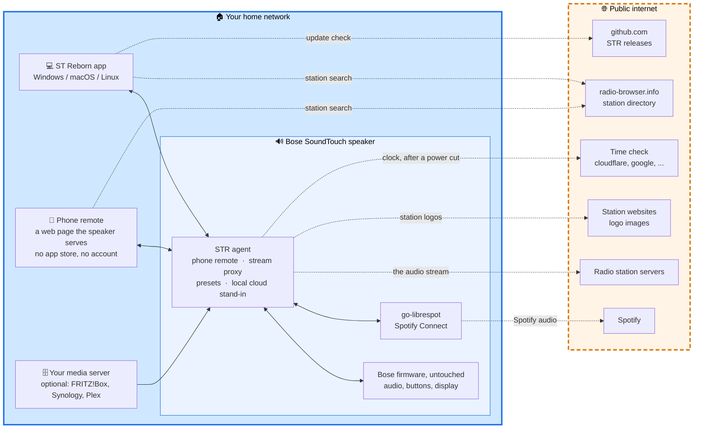
```mermaid
flowchart LR
  subgraph Home["🏠 Your home network"]
    direction TB
    Desktop["💻 ST Reborn app<br/>Windows / macOS / Linux"]
    Phone["📱 Phone remote<br/>a web page the speaker serves<br/>no app store, no account"]
    NAS["🗄️ Your media server<br/>optional: FRITZ!Box, Synology, Plex"]
    subgraph Speaker["🔊 Bose SoundTouch speaker"]
      direction TB
      Agent["STR agent<br/>phone remote  ·  stream proxy<br/>presets  ·  local cloud stand-in"]
      BoseFW["Bose firmware, untouched<br/>audio, buttons, display"]
      GLR["go-librespot<br/>Spotify Connect"]
    end
  end

  subgraph Net["🌐 Public internet"]
    direction TB
    RB["radio-browser.info<br/>station directory"]
    CDN["Radio station servers"]
    Logos["Station websites<br/>logo images"]
    SpotifyAP["Spotify"]
    GH["github.com<br/>STR releases"]
    Time["Time check<br/>cloudflare, google, ..."]
  end

  Desktop <--> Agent
  Phone <--> Agent
  NAS --> Agent
  Agent <--> BoseFW
  Agent <--> GLR

  Desktop -. "station search" .-> RB
  Desktop -. "update check" .-> GH
  Phone -. "station search" .-> RB
  Agent -. "the audio stream" .-> CDN
  Agent -. "station logos" .-> Logos
  Agent -. "clock, after a power cut" .-> Time
  GLR -. "Spotify audio" .-> SpotifyAP

  style Home fill:#cfe8ff,stroke:#1f6feb,stroke-width:3px,color:#000
  style Speaker fill:#eaf3ff,stroke:#1f6feb,color:#000
  style Net fill:#fff4e5,stroke:#d97706,stroke-width:3px,stroke-dasharray:8 5,color:#000
```

### Who reaches the internet, and who does not

| Reaches the internet | For what | When |
|---|---|---|
| **Desktop app** | radio-browser.info | only while you search for a station |
| **Desktop app** | github.com | update check, and downloading a new version |
| **Phone remote** | radio-browser.info | only while you search for a station, **from the phone itself**, not through the speaker |
| **Speaker (agent)** | the radio station's server | while a station plays |
| **Speaker (agent)** | station websites | to fetch the logo shown on the display |
| **Speaker (agent)** | a few well-known hosts | one time check after a power cut: the speaker has no clock battery, and a wrong clock breaks HTTPS and Spotify |
| **Speaker (go-librespot)** | Spotify | while Spotify plays |

Never reaches the internet: **the Bose firmware**. That is the point of the
project. Its cloud calls are redirected to the agent on the speaker itself
(`/etc/hosts` plus iptables), so `streaming.bose.com` and the `bmx-cloud`
services resolve to `127.0.0.1` and are answered locally. The speaker works
with the internet unplugged, apart from the audio itself.

**No STR component ever calls a Bose server, and none calls a server run by
this project.** There is no STR account, no telemetry, and no analytics. The
releases come from GitHub and the station directory is a public community
service; both are third parties you can verify for yourself.

### Which port, and why two of them

The desktop app and the phone remote reach the agent on **`:8888`** on sm2
chassis (ST10 `rhino`, sm2 ST30/ST20) and on **`:17008`** on whitelisted
chassis (Portable `taigan`, scm ST20/ST30, Wave `lisa`), where an iptables
PREROUTING REDIRECT forwards `:17008` to `:8888` because the chipset firewall
drops the direct port. Both apps try one and fall back to the other, so this
is invisible in normal use. It matters when reading a log: an address with
`:17008` in it is the same agent, reached the long way round. See
[`MODEL-VARIANTS.md`](./MODEL-VARIANTS.md).

## Three engineering views

The "Big picture" above is a **trust** diagram: it answers "what leaves my
network". It is deliberately not an engineering drawing. The three views
below are, and each one answers a different question:

| View | Question it answers | Source of truth below |
|---|---|---|
| [1. Network](#view-1-the-network) | Who opens a connection to whom, on which port, and does it leave the house? | [Network ports](#network-ports), [Communication flows](#communication-flows) |
| [2. Operating system](#view-2-the-operating-system-on-the-speaker) | Which files are read, written and created on the speaker, on which filesystem, and what survives a reboot or a factory reset? | [Storage layout on the speaker](#storage-layout-on-the-speaker) |
| [3. Components](#view-3-components-and-libraries) | Which Go packages exist, which of them talk to each other, and where the deliberate seams are | [Components](#components), [Tech stack](#tech-stack) |

If a diagram and the section it points at disagree, the section wins: the
diagrams are drawn from the code, but they are drawings.

---

### View 1: the network

Every arrow is an **initiator reaching a listener**. Solid arrows stay
inside the house, dotted arrows leave it. Loopback traffic never touches
the network at all: the agent and the Bose firmware are two processes on
the same speaker, and almost all of the interesting traffic between them
is `127.0.0.1`.


```mermaid
flowchart TB
  subgraph WAN["Public internet"]
    direction LR
    RB["radio-browser.info"]
    CDN["Radio CDNs<br/>audio and station logos"]
    SPOT["Spotify access points"]
    GH["github.com and st-reborn.de<br/>update check"]
    TIME["Clock check<br/>HEAD, Date header only"]
    TTS["Google Translate<br/>announcements only"]
  end

  subgraph HOME["Home network"]
    direction TB
    APP["ST Reborn app on the PC<br/>listens on nothing, except<br/>during a factory-reset unlock"]
    PHONE["Phone remote<br/>a page the speaker serves"]
    NAS["DLNA media server"]
    PEER["Another speaker<br/>running the STR agent"]

    subgraph BOX["One SoundTouch speaker"]
      direction TB
      subgraph AGENT["STR agent, one Go process"]
        W["8888: webui, phone page,<br/>stream proxy, Spotify stream"]
        M["443 and 9080: marge, 8081: BMX<br/>the local cloud stand-in"]
      end
      GLR["go-librespot<br/>local API on 3678"]
      subgraph FW["Bose firmware, stock"]
        F90["8090 BoseApp REST"]
        F91["8091 UPnP AVTransport"]
        F80["8080 gabbo WebSocket"]
        F17["17000 TAP shell"]
      end
    end
  end

  APP -->|"HTTP /api on 17008 or 8888"| W
  PHONE -->|"HTTP /api, polling, no WebSocket"| W
  APP -->|"HTTP 8090, install and settings"| F90
  APP -->|"TCP 17000, stick-free SSH unlock"| F17
  APP -->|"SSH 22, install, uninstall, log export"| BOX
  PEER -->|"HTTP 17008, pulls the master audio"| W
  W -->|"HTTP 17008, zones, group keys, volume"| PEER
  APP <-.->|"mDNS 5353"| W
  W -->|"SSDP 1900 and SOAP, library browse"| NAS

  W -->|"SOAP 8091, SetURI, Play, Stop"| F91
  W -->|"HTTP 8090, presets, volume, zones"| F90
  F80 -->|"push only, key and power events"| W
  W -->|"TCP 17000, wake, log facilities"| F17
  F90 -->|"HTTPS 443 to streaming.bose.com,<br/>pinned to 127.0.0.1 by /etc/hosts"| M
  F91 -->|"HTTP 8888, pulls the audio"| W
  W <-->|"HTTP 3678, play, volume, events"| GLR

  W -.->|"the audio bytes, station logos"| CDN
  W -.->|"clock, after a power cut"| TIME
  W -.->|"announcement text to speech"| TTS
  GLR -.->|"Spotify audio"| SPOT
  APP -.->|"station search"| RB
  PHONE -.->|"station search, from the phone itself"| RB
  APP -.->|"update check and download"| GH

  style HOME fill:#cfe8ff,stroke:#1f6feb,stroke-width:3px,color:#000
  style BOX fill:#eaf3ff,stroke:#1f6feb,color:#000
  style AGENT fill:#dff0d8,stroke:#2f855a,color:#000
  style FW fill:#f5f5f5,stroke:#666,color:#000
  style WAN fill:#fff4e5,stroke:#d97706,stroke-width:3px,stroke-dasharray:8 5,color:#000
```

Five things this drawing is meant to make obvious, because each of them
has cost real debugging time:

1. **The Bose firmware never leaves the house.** Every one of its cloud
   calls terminates on the same speaker, in the agent. That is the whole
   project in one arrow.
2. **`:17008` is not only how the app reaches a BCO box.** On *every*
   chassis a follower pulls the master's audio from
   `master:17008/stream/<slot>` while a mirror group plays, so it is an
   audio path between speakers, not just a control path
   (`mirrorStreamPort`, `internal/webui/zones_stereo.go`).
3. **mDNS always advertises port 8888**, even on chassis where 8888 is
   not reachable from the LAN. That is why both the app and the agent
   probe and fall back rather than trusting the SRV record.
4. **The gabbo bus is push only.** STR subscribes to nothing and sends
   nothing on it beyond protocol pings. It connects to `ws://box:8080/`
   and names `gabbo` as the WebSocket **subprotocol**, not as a path.
5. **The PC listens exactly once**: during the factory-reset unlock the
   app binds `:19080` and the *speaker* calls back into it every 60
   seconds. Outside that one flow the app opens connections and accepts
   none.

---

### View 2: the operating system on the speaker

Four storage areas, and which one a file lands in is a decision every
time. The rule behind all of them: **NAND is small, shared with the
firmware, and wears out.** Around 31 MB is all there is, and the Bose
logs live in the same space.

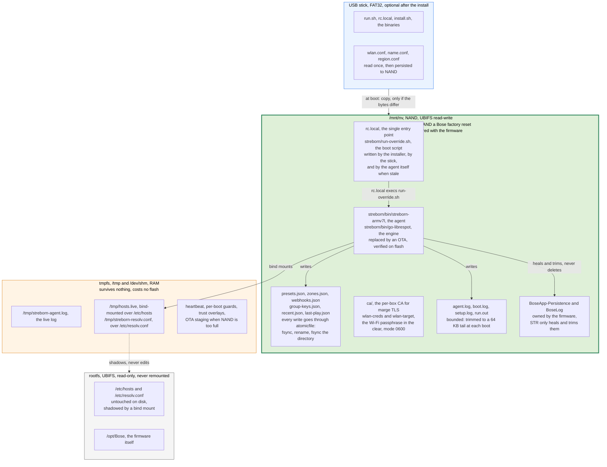
```mermaid
flowchart TB
  subgraph RO["rootfs, UBIFS, read-only, never remounted"]
    R1["/etc/hosts and /etc/resolv.conf<br/>untouched on disk,<br/>shadowed by a bind mount"]
    R2["/opt/Bose, the firmware itself"]
  end

  subgraph NV["/mnt/nv, NAND, UBIFS read-write<br/>survives a reboot AND a Bose factory reset<br/>about 31 MB, shared with the firmware"]
    direction TB
    BOOT["rc.local, the single entry point<br/>streborn/run-override.sh, the boot script<br/>written by the installer, by the stick,<br/>and by the agent itself when stale"]
    BIN["streborn/bin/streborn-armv7l, the agent<br/>streborn/bin/go-librespot, the engine<br/>replaced by an OTA, verified on flash"]
    STORE["presets.json, zones.json, webhooks.json<br/>group-keys.json, recent.json, last-play.json<br/>every write goes through atomicfile:<br/>fsync, rename, fsync the directory"]
    SEC["ca/, the per-box CA for marge TLS<br/>wlan-creds and wlan-target,<br/>the Wi-Fi passphrase in the clear, mode 0600"]
    LOGS["agent.log, boot.log, setup.log, run.out<br/>bounded: trimmed to a 64 KB tail at each boot"]
    BOSE["BoseApp-Persistence and BoseLog<br/>owned by the firmware,<br/>STR only heals and trims them"]
  end

  subgraph TMP["tmpfs, /tmp and /dev/shm, RAM<br/>survives nothing, costs no flash"]
    T1["/tmp/streborn-agent.log, the live log"]
    T2["/tmp/hosts.live, bind-mounted over /etc/hosts<br/>/tmp/streborn-resolv.conf, over /etc/resolv.conf"]
    T3["heartbeat, per-boot guards, trust overlays,<br/>OTA staging when NAND is too full"]
  end

  subgraph USB["USB stick, FAT32, optional after the install"]
    U1["run.sh, rc.local, install.sh, the binaries"]
    U2["wlan.conf, name.conf, region.conf<br/>read once, then persisted to NAND"]
  end

  USB -->|"at boot: copy, only if the bytes differ"| NV
  BOOT -->|"rc.local execs run-override.sh"| BIN
  BIN -->|"writes"| STORE
  BIN -->|"writes"| LOGS
  BIN -->|"bind mounts"| T2
  T2 -.->|"shadows, never edits"| RO
  BIN -->|"heals and trims, never deletes"| BOSE

  style NV fill:#dff0d8,stroke:#2f855a,stroke-width:3px,color:#000
  style TMP fill:#fff4e5,stroke:#d97706,color:#000
  style RO fill:#f5f5f5,stroke:#666,color:#000
  style USB fill:#eaf3ff,stroke:#1f6feb,color:#000
```

**Power on to "the agent is listening"**, in the order it actually
happens:

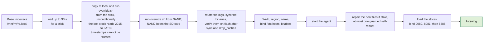
```mermaid
flowchart LR
  A["Bose init execs<br/>/mnt/nv/rc.local"] --> B["wait up to 30 s<br/>for a stick"]
  B --> C["copy rc.local and run-override.sh<br/>from the stick, unconditionally:<br/>the box clock reads 2015, so FAT32<br/>timestamps cannot be trusted"]
  C --> D["run-override.sh from NAND;<br/>NAND beats the SD card"]
  D --> E["rotate the logs, sync the binaries,<br/>verify them on flash after<br/>sync and drop_caches"]
  E --> F["Wi-Fi, region, name,<br/>bind /etc/hosts, iptables"]
  F --> G["start the agent"]
  G --> H["repair the boot files if stale,<br/>at most one guarded self-reboot"]
  H --> I["load the stores,<br/>bind 9080, 8081, then 8888"]
  I --> J["listening"]
  style J fill:#dff0d8,stroke:#2f855a,color:#000
```

**Why so few writes.** The steady state costs almost no flash, and that
is deliberate:

- The live log is on tmpfs. NAND only holds a bounded 256 KB mirror.
- The recently-played list is debounced by 90 seconds, so a station that
  changes its ICY title every few minutes is one write, not twenty.
- The peer roster is written only when its fingerprint changes, and at
  most every six hours.
- Boot files, the engine, the priority attributes in the firmware's own
  Wi-Fi profile: each compares first and skips the write when the bytes
  already match. A healthy boot writes nothing.
- The crash log is written only **when the agent exits**, so a box that
  runs for months never touches it.
- The 30-second heartbeat lives in RAM. On NAND it would be 2880 writes
  a day for nothing.

Two files carry a warning label: `wlan-creds` and `wlan-target` hold the
Wi-Fi passphrase in cleartext on NAND, mode 0600. They are what lets a
speaker rejoin a network without the app present, and they are covered in
[`THREAT-MODEL.md`](./THREAT-MODEL.md).

**An uninstall is the same map read backwards**: the agent process, all
of `/mnt/nv/streborn`, `/mnt/nv/rc.local`, and the `/etc/hosts` bind
mount. What it deliberately leaves behind is the box's own network and
account state, because wiping the Wi-Fi profile drops the speaker into
its setup access point and it disappears from the LAN. A full wipe is
what the separate factory-reset path is for.

---

### View 3: components and libraries

About fifty Go packages in two modules. They are drawn in layers, and the
layers are real: nothing in a lower layer imports anything above it.

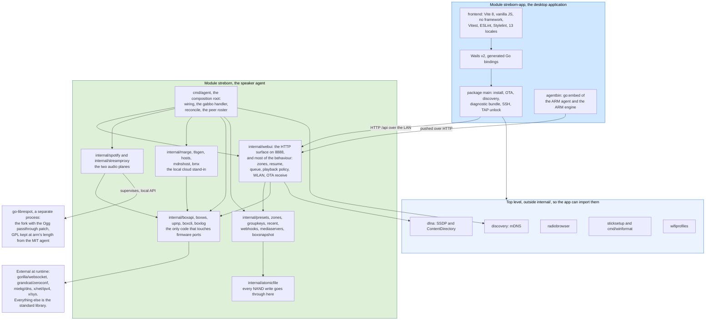
```mermaid
flowchart TB
  subgraph M2["Module streborn-app, the desktop application"]
    UI["frontend: Vite 8, vanilla JS, no framework,<br/>Vitest, ESLint, Stylelint, 13 locales"]
    WAILS["Wails v2, generated Go bindings"]
    APPGO["package main: install, OTA, discovery,<br/>diagnostic bundle, SSH, TAP unlock"]
    EMB["agentbin: go:embed of<br/>the ARM agent and the ARM engine"]
  end

  subgraph SHARED["Top level, outside internal/, so the app can import them"]
    DISC["discovery: mDNS"]
    DLNA["dlna: SSDP and ContentDirectory"]
    RADIO["radiobrowser"]
    STICK["sticksetup and cmd/winformat"]
    WIFI["wifiprofiles"]
  end

  subgraph M1["Module streborn, the speaker agent"]
    ROOT["cmd/agent, the composition root:<br/>wiring, the gabbo handler,<br/>reconcile, the peer roster"]
    WEBUI["internal/webui: the HTTP surface on 8888,<br/>and most of the behaviour: zones, resume,<br/>queue, playback policy, WLAN, OTA receive"]
    AUDIO["internal/spotify and internal/streamproxy<br/>the two audio planes"]
    CLOUD["internal/marge, tlsgen, hosts,<br/>mdnshost, bmx<br/>the local cloud stand-in"]
    WIRE["internal/boxapi, boxws, upnp, boxcli, boxlog<br/>the only code that touches firmware ports"]
    STORES["internal/presets, zones, groupkeys, recent,<br/>webhooks, mediaservers, boxsnapshot"]
    ATOMIC["internal/atomicfile<br/>every NAND write goes through here"]
  end

  EXT["External at runtime:<br/>gorilla/websocket, grandcat/zeroconf,<br/>miekg/dns, x/net/ipv4, x/sys.<br/>Everything else is the standard library."]
  GLRP["go-librespot, a separate process:<br/>the fork with the Ogg passthrough patch,<br/>GPL kept at arm's length from the MIT agent"]

  UI --> WAILS
  WAILS --> APPGO
  APPGO --> SHARED
  APPGO -->|"HTTP /api over the LAN"| WEBUI
  EMB -->|"pushed over HTTP"| WEBUI
  ROOT --> WEBUI
  ROOT --> AUDIO
  ROOT --> CLOUD
  ROOT --> WIRE
  ROOT --> STORES
  ROOT --> DISC
  WEBUI --> STORES
  WEBUI --> WIRE
  WEBUI --> DLNA
  AUDIO --> WIRE
  AUDIO -->|"supervises, local API"| GLRP
  CLOUD --> WIRE
  STORES --> ATOMIC
  WIRE --> EXT

  style M1 fill:#dff0d8,stroke:#2f855a,color:#000
  style M2 fill:#cfe8ff,stroke:#1f6feb,color:#000
  style SHARED fill:#eaf3ff,stroke:#1f6feb,color:#000
```

**The seams are the interesting part.** Several edges you would expect to
find do not exist, on purpose. They are wired up at the composition root
instead, which is what lets the packages be tested without a speaker:

- `internal/webui` does **not** import `internal/spotify`. Twenty-four
  function values are passed in instead, so the HTTP surface can be
  tested with no Spotify engine anywhere near it.
- `internal/webui` does **not** import `internal/marge` either; six
  method values do that job.
- `internal/boxws` knows nothing about presets, zones or webhooks. It
  emits typed events through a `Handler` interface, and the
  implementation that decides what to do with them lives in `cmd/agent`.
- `internal/boxlog` reads the speaker's syslog ring without importing
  anything box-specific: it is handed `boxcli.Send` as a closure. Its
  own import list is standard library only.
- `/api/debug/state` carries the state of TLS, DNS, marge, the box
  syslog and Spotify without `webui` importing any of them, through a
  package-level registry the agent fills at start
  (`webui.RegisterDebugSection`).

**Two browser stacks, not one.** The desktop frontend is Vite plus
vanilla ES modules with a test runner and a lint chain. The phone remote
is a single hand-written HTML file the agent serves, with no framework,
no build step and no external script tag at all. They call the same
`/api/*` routes and share nothing else.

**One process boundary that is not an accident.** go-librespot runs as a
separate process, controlled over a localhost API. It is GPL-3.0 and the
agent is MIT, so two binaries keep that clean, and an engine crash does
not take the speaker's radio down with it.

---
## Components

| Component | Lives in | Runtime | Job |
|---|---|---|---|
| **Stick agent** | `cmd/agent/`, `internal/` | Go binary on the speaker NAND, started by `/mnt/nv/streborn/run-override.sh` from Bose `rc.local` | Emulates the Bose cloud (marge, BMX), proxies radio streams (incl. HLS conversion), owns the preset store, announces over mDNS, hooks the speaker's WebSocket bus to re-enable hardware preset buttons, manages multiroom zones (NAND `zones.json`, auto-reform), and fires user-configured webhooks on box events (NAND `webhooks.json`). On whitelisted chassis it also installs the iptables PREROUTING REDIRECTs that make it LAN-reachable, and serves the `:17002` BatteryMonitor fallback on the Portable. |
| **Spotify plane** | `internal/spotify/`, `go-librespot` binary on NAND | go-librespot runs as a Spotify Connect receiver, supervised by the agent's `spotify.Manager` | Spotify Connect on the speaker without the Bose cloud. go-librespot decodes nothing: with the fork's `audio_output_pipe_passthrough` it writes the raw Ogg/Vorbis bitstream to a pipe; the agent serves it at `/spotify/stream.ogg` on :8888 and points the box's UPnP renderer there. Preset recall drives go-librespot's local play API (no token plane). Multi-account is done by swapping credentials + restarting go-librespot (fragile, see fork issue #1). |
| **Desktop app** | `desktop-app/` | Wails app (Go backend + Vite frontend), built for Windows, macOS, Linux | Discovers agents over mDNS, talks to them by REST, ships a UI for radio search (app-side, direct to radio-browser.info), presets, playback (with the live now-playing track + bitrate), a DLNA media library, Spotify Connect, multiroom, settings, webhooks (smart-home triggers), diagnostics export, OTA agent updates, network first-install (stick-free `:17000` unlock, USB stick as fallback), and box maintenance (true factory reset, uninstall STR, setup-AP Wi-Fi push). |
| **Local library (DLNA)** | `dlna/` (top level so Wails can import it) | Imported by the desktop app **and by the agent** (`internal/webui/librarybrowse.go`, `librarysearch.go`), so the speaker itself does SSDP for the phone page | SSDP discovery + ContentDirectory browse of LAN media servers (FRITZ!Box, Synology, Plex, miniDLNA). The app saves a track's stream URL as a normal preset; the box pulls it via the streamproxy. |
| **Multiroom** | the logic is `internal/webui` (`zones_stereo.go`, `zones_default_group.go`, `zonevolume.go`, `zonemirror.go`, `dissolve*.go`, ~4900 lines); `internal/zones` is persistence only (~160 lines), `internal/boxapi` has the zone primitives | Agent endpoints `/api/box/zone` + `/api/box/group` | Groups speakers via the box's native `/setZone` (firmware-synced) or a per-agent mirror fallback, plus stereo pairs. Membership persists in `/mnt/nv/streborn/zones.json` and auto-reforms after reboot/standby/Wi-Fi outage. Group keys (`internal/groupkeys`, `/api/groupkeys`, NAND `group-keys.json`) put a saved group on a remote's thumbs key: a press forms it through the main speaker's agent, the next press dissolves it (see `docs/AUTOMATION.md`). |
| **Setup wizard** | `sticksetup/`, `cmd/winformat/` (in-app); `setup/` (legacy PowerShell) | Embedded in the desktop app; `winformat.exe` handles FAT32 formatting | Prepares a FAT32 USB stick with Wi-Fi credentials, region, friendly name, language, and the bootstrap shell scripts, then drives the install over SSH. The standalone PowerShell wizard in `setup/` is legacy. |
| **USB stick filesystem** | `usb-stick/` | Files written to a FAT32 stick by the wizard | Boot-time bootstrap (`rc.local`, `run.sh`, `install.sh`), one-shot config (`wlan.conf`, `name.conf`, `region.conf`, `lang.conf`, `presets.json`), `str-shim.so`, `version.txt`, and the agent binary itself. `run.sh` persists name/region to NAND as `name.txt`/`region.txt`. |
| **mDNS discovery** | `discovery/` (top level on purpose, see `CLAUDE.md`) | Imported by both the agent and the desktop app | Service types `_streborn._tcp.local` **and** the legacy `_soundtouchstick._tcp.local`. TXT keys: `version`, `build`, `deviceID`, `boxDeviceID`, `model`, `friendlyName`, `path=/api`. The announced port is always **8888**, even on chassis where 8888 is not LAN-reachable, which is why every client probes and falls back to `:17008` instead of trusting the record. |
| **Website** | separate repo `JRpersonal/streborn-website` | Astro static site, EN and DE | Downloads, FAQ, Verify page with SHA256 and Sigstore click-paths, legal pages. Built on `repository_dispatch` from this repo's release workflow. |

**Sources are presets.** A preset slot or hardware button (1 to 6) can
hold an internet radio station, a Spotify playlist/album/track, or a
track from a LAN media server. They all converge on the same playback
path: the box's UPnP renderer pulls from the agent's stream proxy
(`/stream/...`, `/spotify/stream.ogg`) or directly from a radio CDN. No
source ever depends on the dead Bose cloud.

**In progress.** Two more sources reuse this pattern: **podcasts**
(search, play, subscribe-a-show-to-a-preset; design in #215) and
**Deezer** (read and create Deezer presets; see [`ROADMAP.md`](./ROADMAP.md)).
SoundCloud (#241), SiriusXM (#242), and Pandora (#243) are at feasibility.
Each runs through a bridge STR controls and hands the box a stream URL,
never a cloud credential.

**Smart home.** Box events (a remote-control key, the power button, an
AUX change) can fire user-configured HTTP webhooks, UDP packets or
Wake-on-LAN (NAND `webhooks.json`), so a key press can drive Home
Assistant, ioBroker, Node-RED, or any endpoint on the LAN. Preset, AUX
and power come off the gabbo bus; Back, Forward, Thumbs up/down and
Play/Pause come from the speaker's own key trace, which the agent reads
out of the firmware's RAM-only syslog ring (`internal/boxlog`, see
[`AUTOMATION.md`](./AUTOMATION.md)).

**Box forensics in the diagnostic bundle.** The same `logread -f`
reader keeps two bounded, RAM-only copies of what the firmware logs
about itself and exposes them on `/api/debug/state`, so the desktop
app's diagnostic bundle (`box-<n>.json`, `debugState`) carries them:
`box_syslog_events` (up to 200 classified events: the playback failure
reasons APServer and BoseApp log when a stream does not start, such as
`BAD_URL`, no first frame, a terminal server error or a buffer
underrun, plus the URL the firmware tried; standby and wake
transitions of the system controller and scmmond's low-power
notifications; the Wi-Fi status and signal quality the sm2 chassis
logs once a minute; MargeClient errors about STR's own answers; and
the "getting swamped?" overload warning; the standby and wake lines are
also the agent's wake signal: one deduplicated `PowerEvent` per
transition reaches the same `OnEnterStandby` / `OnStandbyExit` handlers
the gabbo bus feeds, so a speaker switched on at the box or by its
remote is noticed even on a chassis that never sends the power frame or
while the WebSocket is between recycles, with whichever origin reports
first delivering and the other suppressed within 5 s, visible under
`powerSignal`) and `box_syslog_tail` (the
last 150 ring lines with the TPDA/STSCertified localhost-retry spam and
the clock-sync chatter dropped). The agent hashes SSIDs in both before
they leave the speaker; the app's bundle anonymizer masks IPs and
device ids as it does for every other section. A playback failure
reason that arrived within the last 30 s is also appended to the
agent's own "recall still not playing after retries" warning, and a
few classes (playback failures, standby/wake, overload, marge errors)
are mirrored into the agent log at INFO with a per-class rate limit.
Nothing is written to NAND.

## Tech stack

| Layer | Choice | Why |
|---|---|---|
| Stick agent language | Go 1.25+ (module `github.com/JRpersonal/streborn`; the desktop module `streborn-app` declares Go 1.26) | Static single binary cross-compiles to `linux/arm/v7` from any host. No runtime on the speaker beyond BusyBox. |
| Desktop backend | Go via Wails v2 (`github.com/wailsapp/wails/v2`); own module, imports the shared top-level packages `discovery/`, `dlna/`, `radiobrowser/`, `sticksetup/`, `wifiprofiles/` | Same language as the agent. Go forbids importing the agent module's `internal/`, which is why the shared packages are top-level. |
| Desktop frontend | Vite 8 + vanilla JS (no framework), i18n layer with 13 locales (EN, DE, ES, FR, JA, LT, LV, NL, PL, TR, UK, AR, ZH-Hant), including right-to-left layout for Arabic | Keeps the binary small and the build chain dependency-light. No React/Vue tax for the UI. |
| mDNS | `github.com/grandcat/zeroconf` | Pure Go, dual stack, works on all three desktop OSes and on the speaker. |
| WebSocket | `github.com/gorilla/websocket` | Reuses the gabbo subprotocol the Bose firmware expects on `:8080`. |
| Radio source | `radio-browser.info` HTTP API | Free, no key, community-maintained. Replaces the dead Bose TuneIn integration. The stream proxy also reads the live ICY `StreamTitle` so the app can show the current track. |
| Spotify | `go-librespot` (fork `JRpersonal/go-librespot`, Ogg passthrough patch) | Open-source Spotify Connect client in Go. Passthrough avoids decoding on the weak ARM CPU: the raw Ogg/Vorbis is handed straight to the box, which decodes it. The passthrough patch is offered upstream as `devgianlu/go-librespot` PR #316. |
| Setup wizard host script | PowerShell 5.1 on Windows | Ships with every Windows; no Python install required for the user. |
| FAT32 helper | Custom Go tool (`cmd/winformat`) | Avoids elevation prompts and shell quoting around `diskutil` / `format`. |
| Distribution | Portable `.exe` + `.zip` (Windows), `.dmg` via `hdiutil` (macOS), `.tar.gz` with a per-user `install.sh` (Linux) | No installer framework. The Windows build is code-signed with a Certum "Open Source" certificate in a dedicated `sign-windows` release job; the macOS app and the DMG are Developer ID signed and notarized by Apple in the macOS build job, each with its own stapled ticket. |
| CI | GitHub Actions, all actions SHA-pinned | Build provenance via Sigstore (`actions/attest-build-provenance`). |
| Verification | SHA256 + Sigstore attestations, plus a Certum code signature on Windows and Apple notarization on macOS | Signed Windows builds show a verified publisher, notarized macOS builds open without a Gatekeeper warning. The Verify page still documents both warnings, because SmartScreen keeps warning until the signature accrues reputation, and a build can ship without an Apple ticket when the notary service stalls. |

## Network ports

### On the speaker (when STR is running)

STR's own ports are bound on loopback and the LAN interface; the Bose
firmware ports are stock. External reachability splits by chassis:

- **sm2 chassis (ST10 `rhino`, ST30 `mojo`)**: STR's ports are reachable
  directly, but only because `run.sh` punches `INPUT ACCEPT` rules for
  them past the Bose stock firewall (`iptables-setup.sh`).
- **Whitelisted chassis (Portable `taigan`, ST20 `spotty` and `scm`)**:
  the network chipset accepts inbound external TCP only to listeners
  owned by a Bose binary, so STR's own ports are **not** reachable from
  the LAN directly. STR installs an iptables PREROUTING `REDIRECT` that
  maps the Bose-owned external port `:17008` onto the loopback STR
  listener `:8888`. Where NAT is unavailable, an LD_PRELOAD shim on
  `/opt/Bose/SoftwareUpdate` (`usb-stick/shim/shim.c`) is the fallback
  entry path; today the shim is skipped on every catalogued chassis and
  remains only for uncatalogued variants.

| Port | Listener | Role | LAN reachable |
|---|---|---|---|
| 22 | sshd (Bose, started by STR) | **Opt-in.** `run.sh` (`ensure_sshd_running`) force-starts sshd only when the NAND marker `/mnt/nv/streborn/enable-ssh` is present. Otherwise SSH follows Bose's own gate: open while an STR stick with `remote_services` is inserted, closed on a stickless steady-state boot. The trade-off is that SSH diagnostics and the SSH-OTA fallback need the stick plugged back in (see `THREAT-MODEL.md`). | LAN (only while enabled) |
| 80 | _(nobody , firmware OUTBOUND)_ | **Not a listener.** This is the firmware's **outbound** HTTP cloud call (to `streaming.bose.com`). iptables NAT-redirects it to STR's :9080; **STR never binds :80** and the firmware does not listen on it. Listed only because STR claims this outbound traffic. | outbound (firmware) -> redirected to :9080 |
| 443 | STR marge HTTPS | TLS cloud-stub for `streaming.bose.com` after the Hosts redirect. | loopback (firmware) |
| 3678 | go-librespot local API (started by STR) | The agent's `spotify.Manager` drives playback here (`/player/play`, shuffle, next, volume) and reads track events. | loopback |
| 7000 | STSCertified (Bose) | TLS endpoint inside the firmware. Untouched. | internal |
| 8080 | WebServer / gabbo (Bose) | The WebSocket bus, at `ws://127.0.0.1:8080/`: `gabbo` is the WebSocket **subprotocol**, not a path. STR connects as a client and only receives, it subscribes to nothing and sends nothing but protocol pings. The connection is kept genuinely persistent via ping/pong keepalive (a silent ~11 min client-side self-timeout was fixed in v0.9.21; see `FIRMWARE-NOTES.md`). | internal |
| 8081 | STR BMX stub | Healthz-only placeholder for `content.api.bose.io`; the `/bmx/registry/v1/services` route is answered by marge via the hosts rewrite. | sm2: direct (INPUT ACCEPT) / whitelisted chassis: loopback |
| 8090 | BoseApp (Bose) | REST: `/info`, `/now_playing`, `/presets`, `/select`, `/volume`, zones, ... STR reads and writes here. | internal |
| 8091 | UPnP AVTransport (Bose) | STR sets the stream URL via SetURI; the speaker fetches and decodes. | internal |
| 8443 | STR marge HTTPS (alt) | Same handler as :443; used when :443 cannot be claimed. | sm2: direct (INPUT ACCEPT) / whitelisted chassis: loopback |
| 8888 | STR webui + streamproxy | `/api/*` for the desktop app, the `/stream/<slot>` radio reverse proxy that survives CDN token expiry, and `/spotify/stream.ogg` (the raw Ogg the box pulls for Spotify). HLS playlists are converted to one continuous ADTS/MP3 stream; `/api/stream-status` reports upstream failures. | sm2: direct (INPUT ACCEPT) / whitelisted chassis: via :17008 REDIRECT |
| 9080 | STR marge HTTP | Plain-text marge target after the firmware's outbound :80 is NAT-redirected. | sm2: direct (INPUT ACCEPT) / whitelisted chassis: loopback |
| 17000 | TAP command shell (Bose) | Stock telnet-style diagnostic shell (`envswitch`, `sys configuration`, `sys reboot`). The desktop app drives it for the stick-free SSH unlock during a network install and for uninstall/repair (`desktop-app/telnet_enable_ssh.go`, `internal/boxcli`). STR does not bind it. | LAN |
| 17002 | STR BatteryMonitor fallback | **Portable only.** Bound when the Bose `BatteryMonitor` service is wedged, so BoseApp's battery client connects instead of connect-storming a dead port. This is the ~27 min reboot fix (v0.6.18); see [`FIRMWARE-NOTES.md`](./FIRMWARE-NOTES.md). | loopback (firmware) |
| 17008 | SoftwareUpdate (Bose) | On whitelisted chassis (taigan, spotty, scm) this is STR's external entry point: the PREROUTING REDIRECT sends external :17008 to loopback :8888, which is how the desktop app reaches the agent. | external entry (whitelisted chassis) |
| 40020 | scmmond (Bose) | System-control / battery-MCU manager that feeds `BatteryMonitor`. STR does not bind it. | internal |

> **Reading the table:** every row is a port some process *listens on*, with the
> one exception of **:80**. That row is the firmware's *outbound* cloud
> destination that STR intercepts via iptables, not an inbound listener. Nothing
> listens on :80 for STR's sake.

**How the desktop app reaches the agent:** mDNS advertises the agent on
`:8888`, but on BCO boxes that port is not externally reachable, so the app
probes and uses the **verified-reachable** port (`:17008` on BCO, `:8888`
on ST10). `:9080` is the production marge HTTP port; `--listen-marge :80`
in `cmd/agent` is a test default only.

### On the desktop app host

The desktop app does not listen on any port. It only initiates
connections over the LAN.

## Communication flows

### 1. LAN discovery

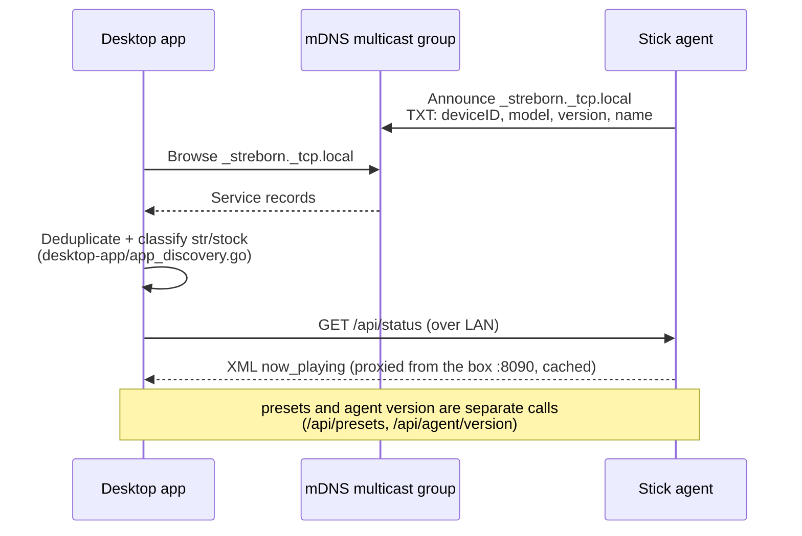
```mermaid
sequenceDiagram
  participant App as Desktop app
  participant Net as mDNS multicast group
  participant Agent as Stick agent
  Agent->>Net: Announce _streborn._tcp.local<br/>TXT: deviceID, model, version, name
  App->>Net: Browse _streborn._tcp.local
  Net-->>App: Service records
  App->>App: Deduplicate + classify str/stock<br/>(desktop-app/app_discovery.go)
  App->>Agent: GET /api/status (over LAN)
  Agent-->>App: XML now_playing (proxied from the box :8090, cached)
  Note over App,Agent: presets and agent version are separate calls<br/>(/api/presets, /api/agent/version)
```

Agents are also picked up as legacy `_soundtouchstick._tcp` so old
sticks built before the rename keep working. The app additionally
browses the stock Bose service types (`_soundtouch._tcp` and the
`_bose-soundtouch._tcp` alias) so speakers that do NOT yet run STR
appear as "stock, needs install" next to STR boxes; an STR record
always wins over a stock record for the same box.

### 2. Radio search and playback

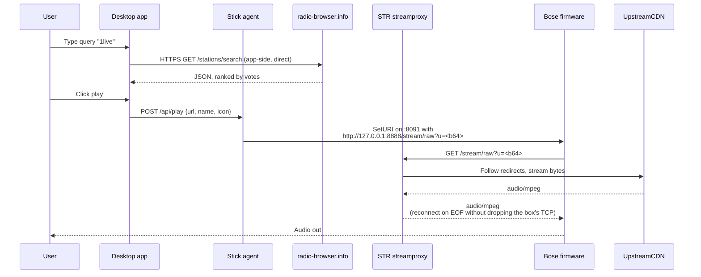
```mermaid
sequenceDiagram
  participant User
  participant App as Desktop app
  participant Agent as Stick agent
  participant RB as radio-browser.info
  participant SP as STR streamproxy
  participant Spk as Bose firmware
  User->>App: Type query "1live"
  App->>RB: HTTPS GET /stations/search (app-side, direct)
  RB-->>App: JSON, ranked by votes
  User->>App: Click play
  App->>Agent: POST /api/play {url, name, icon}
  Agent->>Spk: SetURI on :8091 with<br/>http://127.0.0.1:8888/stream/raw?u=<b64>
  Spk->>SP: GET /stream/raw?u=<b64>
  SP->>UpstreamCDN: Follow redirects, stream bytes
  UpstreamCDN-->>SP: audio/mpeg
  SP-->>Spk: audio/mpeg<br/>(reconnect on EOF without dropping the box's TCP)
  Spk-->>User: Audio out
```

The streamproxy on `:8888` is the load-bearing mechanism: the speaker
sees a stable `http://127.0.0.1:8888/stream/<slot>` URL forever, while
the agent internally handles CDN token expiry and reconnects without
the speaker noticing. It also requests ICY metadata from the upstream,
de-interleaves it so the box still gets clean audio, and exposes the live
`StreamTitle` at `/api/stream/title`, which the desktop app shows as the
now-playing track next to the station name (with a marquee when too long).

HLS-only stations (the BBC nationals, Radio France, ...) are converted
on the fly: the proxy follows the live media playlist, demuxes the
MPEG-TS segments, and serves one continuous ADTS/MP3 stream, because
the box can neither follow playlists nor read TS containers (#124).
Failures are asynchronous (the box accepts the URI; a 403/503 only
surfaces when bytes are pulled), so the agent records the last terminal
upstream failure at `/api/stream-status`; the app polls it for a few
seconds after each play and silently retries with an alternative
radio-browser entry of the same station before showing a reason-classed
error.

### 3. Hardware preset button (short press)

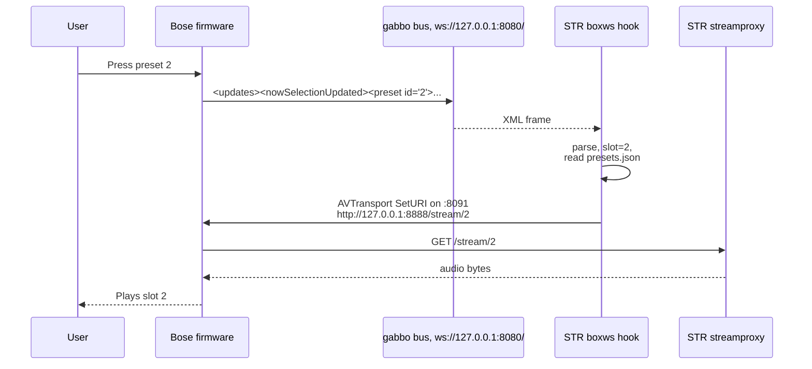
```mermaid
sequenceDiagram
  participant User
  participant Spk as Bose firmware
  participant WS as gabbo bus, ws://127.0.0.1:8080/
  participant Agent as STR boxws hook
  participant SP as STR streamproxy
  User->>Spk: Press preset 2
  Spk->>WS: <updates><nowSelectionUpdated><preset id="2">...
  WS-->>Agent: XML frame
  Agent->>Agent: parse, slot=2,<br/>read presets.json
  Agent->>Spk: AVTransport SetURI on :8091<br/>http://127.0.0.1:8888/stream/2
  Spk->>SP: GET /stream/2
  SP-->>Spk: audio bytes
  Spk-->>User: Plays slot 2
```

Long-press save is firmware-bound and does not emit a WebSocket
frame, so STR cannot hook it. See issue #69 for the live capture
that proved this and the INTERNET_RADIO re-sourcing path that would
unblock it.

### 3b. Spotify Connect preset recall

A Spotify preset stores a context URI (playlist/album) and the
account that saved it, not a stream URL. Recall drives go-librespot
locally and points the box at its Ogg output.

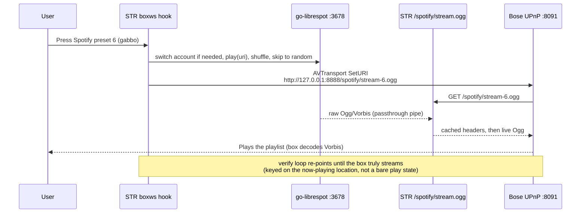
```mermaid
sequenceDiagram
  participant User
  participant Agent as STR boxws hook
  participant GLR as go-librespot :3678
  participant SP as STR /spotify/stream.ogg
  participant Spk as Bose UPnP :8091
  User->>Agent: Press Spotify preset 6 (gabbo)
  Agent->>GLR: switch account if needed, play(uri), shuffle, skip to random
  Agent->>Spk: AVTransport SetURI<br/>http://127.0.0.1:8888/spotify/stream-6.ogg
  Spk->>SP: GET /spotify/stream-6.ogg
  GLR-->>SP: raw Ogg/Vorbis (passthrough pipe)
  SP-->>Spk: cached headers, then live Ogg
  Spk-->>User: Plays the playlist (box decodes Vorbis)
  Note over Agent,Spk: verify loop re-points until the box truly streams<br/>(keyed on the now-playing location, not a bare play state)
```

Key points and their rationale:
- **Passthrough, not PCM.** go-librespot writes the original Ogg/Vorbis
  to a pipe (`audio_output_pipe_passthrough`); the agent serves those
  bytes unchanged and the box decodes them. Decoding to PCM on the ARM
  CPU was too heavy. The proxy batches the pipe at 256 KB to bound a
  Bose firmware RAM leak (per-page flush leaked ~0.4 MB/min).
- **Header replay for late join.** The box self-activates the preset and
  fetches the stream before go-librespot has audio; the proxy replays
  the current track's cached Ogg headers (and a NAND-persisted set on a
  cold boot) so the box buffers instead of flashing "service unavailable".
- **Shuffle + first-press.** Recall loads the context, then shuffles it,
  then skips once, so it starts on a random track (warm and cold). The
  verify loop re-points the box until it really pulls the stream, fixing
  the old "first press does nothing / second press plays" and a track
  restart caused by re-pointing an already-playing stream.
- **Multi-account is the weak spot.** Switching accounts swaps
  `credentials.json` and restarts go-librespot, which leaks the old
  account's audio during the gap and can wedge. The clean fix is native
  multi-account in go-librespot (fork issue #1); tracked separately.

### 4. Marge: local cloud stand-in

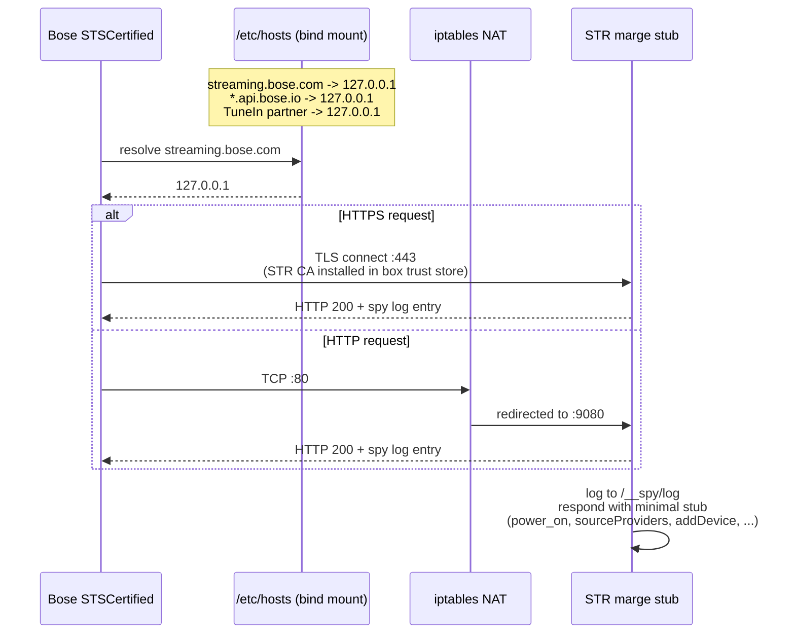
```mermaid
sequenceDiagram
  participant Spk as Bose STSCertified
  participant Hosts as /etc/hosts (bind mount)
  participant Iptables as iptables NAT
  participant Marge as STR marge stub
  Note over Hosts: streaming.bose.com -> 127.0.0.1<br/>*.api.bose.io -> 127.0.0.1<br/>TuneIn partner -> 127.0.0.1
  Spk->>Hosts: resolve streaming.bose.com
  Hosts-->>Spk: 127.0.0.1
  alt HTTPS request
    Spk->>Marge: TLS connect :443<br/>(STR CA installed in box trust store)
    Marge-->>Spk: HTTP 200 + spy log entry
  else HTTP request
    Spk->>Iptables: TCP :80
    Iptables->>Marge: redirected to :9080
    Marge-->>Spk: HTTP 200 + spy log entry
  end
  Marge->>Marge: log to /__spy/log<br/>respond with minimal stub<br/>(power_on, sourceProviders, addDevice, ...)
```

Marge's strategy is not "implement the full Bose cloud" but "respond
with the minimum the firmware accepts as 'cloud reachable, nothing
to do'". The spy log is the development tool that drives which
endpoints get real responses next; everything else gets a generic
`<ack/>` so the firmware does not retry.

### 5. First install (network install, the normal path)

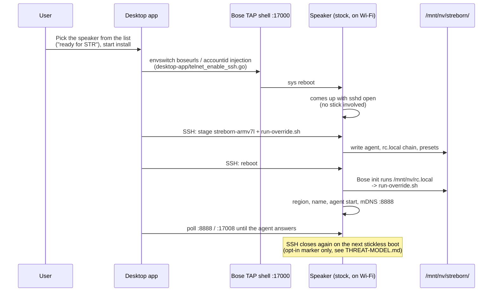
```mermaid
sequenceDiagram
  participant User
  participant App as Desktop app
  participant TAP as Bose TAP shell :17000
  participant Spk as Speaker (stock, on Wi-Fi)
  participant NAND as /mnt/nv/streborn/
  User->>App: Pick the speaker from the list<br/>("ready for STR"), start install
  App->>TAP: envswitch boseurls / accountid injection<br/>(desktop-app/telnet_enable_ssh.go)
  TAP->>Spk: sys reboot
  Spk->>Spk: comes up with sshd open<br/>(no stick involved)
  App->>Spk: SSH: stage streborn-armv7l + run-override.sh
  Spk->>NAND: write agent, rc.local chain, presets
  App->>Spk: SSH: reboot
  Spk->>NAND: Bose init runs /mnt/nv/rc.local<br/>-> run-override.sh
  Spk->>Spk: region, name, agent start, mDNS :8888
  App->>Spk: poll :8888 / :17008 until the agent answers
  Note over Spk: SSH closes again on the next stickless boot<br/>(opt-in marker only, see THREAT-MODEL.md)
```

This is what the "install" button does on a speaker that has never seen
STR: no stick, no second device, no physical access. It is also the only
path for the models that never read a USB stick at boot (ST300, Wave,
SA-4/SA-5, CineMate).

### 5b. First install (USB stick, fallback and recovery)

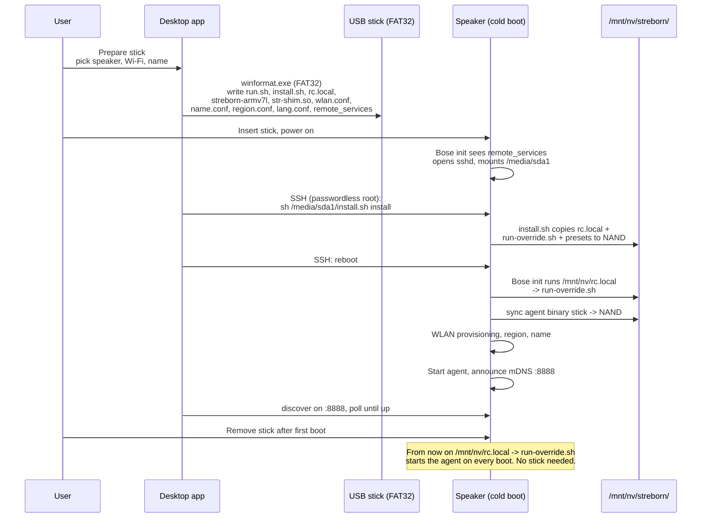
```mermaid
sequenceDiagram
  participant User
  participant App as Desktop app
  participant Stick as USB stick (FAT32)
  participant Spk as Speaker (cold boot)
  participant NAND as /mnt/nv/streborn/
  User->>App: Prepare stick<br/>pick speaker, Wi-Fi, name
  App->>Stick: winformat.exe (FAT32)<br/>write run.sh, install.sh, rc.local,<br/>streborn-armv7l, str-shim.so, wlan.conf,<br/>name.conf, region.conf, lang.conf, remote_services
  User->>Spk: Insert stick, power on
  Spk->>Spk: Bose init sees remote_services<br/>opens sshd, mounts /media/sda1
  App->>Spk: SSH (passwordless root):<br/>sh /media/sda1/install.sh install
  Spk->>NAND: install.sh copies rc.local +<br/>run-override.sh + presets to NAND
  App->>Spk: SSH: reboot
  Spk->>NAND: Bose init runs /mnt/nv/rc.local<br/>-> run-override.sh
  Spk->>NAND: sync agent binary stick -> NAND
  Spk->>Spk: WLAN provisioning, region, name
  Spk->>Spk: Start agent, announce mDNS :8888
  App->>Spk: discover on :8888, poll until up
  User->>Spk: Remove stick after first boot
  Note over Spk: From now on /mnt/nv/rc.local -> run-override.sh<br/>starts the agent on every boot. No stick needed.
```

The first install needs a shell on the box. The app opens one
stick-free over the Bose `:17000` TAP shell (`envswitch boseurls` /
`accountid` injection, see `desktop-app/telnet_enable_ssh.go`) and then
runs the install over SSH. Where that unlock does not take, the
fallback is the SSH channel Bose opens while the box boots with a
`remote_services` stick inserted, which runs `install.sh` and seeds
`/mnt/nv/rc.local`. From the second boot on, Bose's own init runs the
NAND `rc.local` and no SSH is involved. Moving the first install off SSH
is evaluated in
[`docs/STICK-INSTALL-WITHOUT-SSH.md`](./STICK-INSTALL-WITHOUT-SSH.md).

The stick is **recovery media**, not a runtime requirement. See
[`docs/THREAT-MODEL.md`](./THREAT-MODEL.md) for the SSH-while-stick-
inserted window and how it is closed.

### 6. OTA agent update

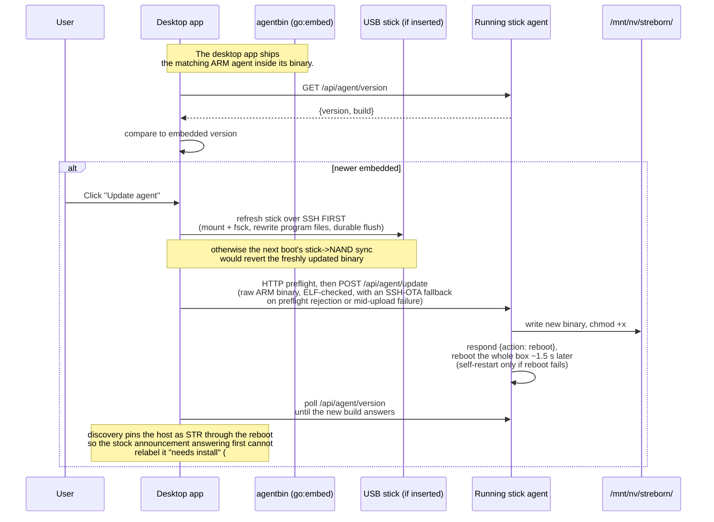
```mermaid
sequenceDiagram
  participant User
  participant App as Desktop app
  participant Embed as agentbin (go:embed)
  participant Stick as USB stick (if inserted)
  participant Agent as Running stick agent
  participant NAND as /mnt/nv/streborn/
  Note over App,Embed: The desktop app ships<br/>the matching ARM agent inside its binary.
  App->>Agent: GET /api/agent/version
  Agent-->>App: {version, build}
  App->>App: compare to embedded version
  alt newer embedded
    User->>App: Click "Update agent"
    App->>Stick: refresh stick over SSH FIRST<br/>(mount + fsck, rewrite program files, durable flush)
    Note over App,Stick: otherwise the next boot's stick->NAND sync<br/>would revert the freshly updated binary
    App->>Agent: HTTP preflight, then POST /api/agent/update<br/>(raw ARM binary, ELF-checked, with an SSH-OTA fallback<br/>on preflight rejection or mid-upload failure)
    Agent->>NAND: write new binary, chmod +x
    Agent->>Agent: respond {action: reboot},<br/>reboot the whole box ~1.5 s later<br/>(self-restart only if reboot fails)
    App->>Agent: poll /api/agent/version<br/>until the new build answers
    Note over App: discovery pins the host as STR through the reboot<br/>so the stock announcement answering first cannot<br/>relabel it "needs install" (#108)
  end
```

Build-stamp coupling is critical: the desktop app and the embedded
ARM agent must come from the same release pipeline run, or the
version check loops. See the build-stamp-sync memory and
`Makefile` `wails-build`, which produces both from one checkout.

### 7. Desktop app auto-update check

This is separate from the speaker-agent OTA above: it is the desktop
app checking whether a newer **app** release exists.

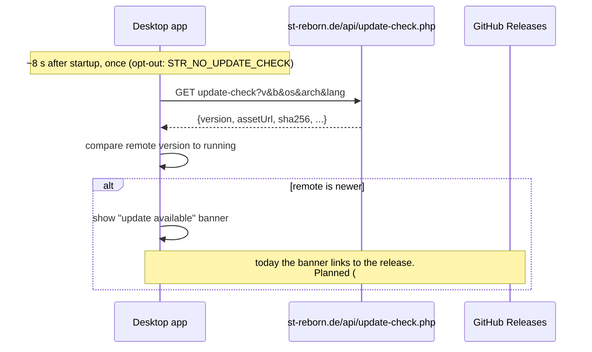
```mermaid
sequenceDiagram
  participant App as Desktop app
  participant Web as st-reborn.de/api/update-check.php
  participant GH as GitHub Releases
  Note over App: ~8 s after startup, once (opt-out: STR_NO_UPDATE_CHECK)
  App->>Web: GET update-check?v&b&os&arch&lang
  Web-->>App: {version, assetUrl, sha256, ...}
  App->>App: compare remote version to running
  alt remote is newer
    App->>App: show "update available" banner
    Note over App,GH: today the banner links to the release.<br/>Planned (#71): in-app download + sha256 verify + relaunch
  end
```

The check sends only the running version, build stamp, OS, CPU
architecture, and UI locale, so the server can return the right asset
and keep a rough version count. No account, no device ID, no personal
data. It is fully disablable with `STR_NO_UPDATE_CHECK=1`.

The request runs through a dedicated **pure-Go** HTTP client: DNS uses
Go's own resolver and TLS verification uses an embedded CA-root bundle
instead of the platform trust store. On macOS the platform path goes
through cgo (Security.framework) and crashed an old Mac on this very
call; the pure-Go path removes the last cgo dependency from the check.
See `desktop-app/update_tls.go`.

### 8. Sticky speaker roster (the on-box picker)

Every agent maintains a durable roster of the other STR speakers so the
phone page's picker is complete even where mDNS is lossy, and stays
complete across reboots ("better one speaker too many than one missing").
Four independent feeds merge into one per-IP map:

1. **mDNS browse** on demand plus a 60 s background tick.
2. **TCP fallback probes**: each sweep re-dials the longest-unseen listed
   peers on their web ports, so a speaker whose announcements get lost is
   still confirmed alive. Confirmation is read-only by design (see the
   deep-standby note in `FIRMWARE-NOTES.md`).
3. **NAND persistence** (`/mnt/nv/streborn/peers.json`): the roster
   survives reboots; entries return dimmed until re-confirmed. Writes are
   membership-change-only and rate-limited to spare the NAND.
4. **App seeding**: whenever the desktop app's discovered speaker set
   changes, it POSTs the full STR set to every agent
   (`POST /api/peers/seed`, delivered via the same cached-port failover as
   all agent calls). Agents predating the endpoint answer 404 and are
   unaffected. `POST /api/peers/forget` removes a stray entry.

Entries dim (listed, not clickable) after ~3 minutes without confirmation
and are dropped only after 12 hours of silence. A speaker in deep standby
therefore stays visible as a dimmed tile until it is woken at the device;
nothing in this subsystem ever wakes or writes to a speaker.

## External dependencies at runtime

| Service | Used by | Required? |
|---|---|---|
| radio-browser.info | Desktop app (radio search/browse runs app-side, directly) | Yes for radio search/browse. No API key, no account. The speaker agent no longer calls it (the box only receives the final stream URL to play). |
| Upstream radio CDNs | Speaker (proxied through the streamproxy) | Yes for actual audio. STR does not host or buffer the stream beyond the in-flight bytes. |
| Spotify access points | go-librespot on the speaker | Only for Spotify Connect playback. Needs a Spotify account that has tapped the device once (Premium, per Spotify Connect). No STR account or token plane; credentials stay on the speaker. |
| `st-reborn.de` update-check | Desktop app, once ~8 s after startup | Optional. Sends only version, build, OS, arch, UI locale; opt-out with `STR_NO_UPDATE_CHECK`. See flow 7 above and the privacy section below. |
| Favicon service (`icons.duckduckgo.com`) | Desktop app webview, only when a station tile has no usable logo of its own | Optional, cosmetic. The browser requests a `<domain>.ico` URL to fetch a station's logo. Only the radio station's own public domain is sent, never user data. When DuckDuckGo also has nothing, the fallback is a locally generated letter monogram (a `data:` URI, no network). Google's favicon service is deliberately not used (data mining). See the logo cascade in `desktop-app/frontend/src/logos.js`. |

Bose's own cloud endpoints (`streaming.bose.com`, `*.api.bose.io`,
TuneIn partner URL) are **redirected to localhost** by `/etc/hosts`
and answered by marge. No outbound traffic is needed there.

## Telemetry, analytics, and privacy

STR has no user accounts, no advertising, and no third-party trackers in
the app. The complete picture of what talks to what:

| Component | Talks to | What is sent |
|---|---|---|
| Speaker (agent + firmware) | **Never** the Bose cloud | STR redirects the Bose cloud hostnames to localhost and answers them itself (marge). The speaker reaches the LAN, the upstream radio CDN (audio, proxied), and, only when the user enables them, Spotify access points (go-librespot) and the user's own configured webhook URLs. Radio search/metadata is no longer fetched by the speaker; the desktop app queries radio-browser.info directly (app-first). |
| Desktop app | `st-reborn.de` update-check, once at startup | Running version, build stamp, OS, CPU arch, UI locale. No account, no device ID, no personal data. Opt-out: `STR_NO_UPDATE_CHECK=1`. Radio search runs in the app (direct to radio-browser.info); only the audio CDN stream flows through the speaker agent. |
| Desktop app webview | `icons.duckduckgo.com` | Only a radio station's own domain, to fetch its logo when the station ships no usable artwork. No user data, no account, no identifier. When DuckDuckGo also has nothing, a local letter monogram is drawn with no network call. Google's favicon service was deliberately not used. |
| Website (`st-reborn.de`) | GoatCounter | Privacy-friendly, cookieless page analytics: no cookies, no cross-site tracking, the visitor IP is not stored. |

Bose's own telemetry endpoint (`events.api.bosecm.com`) and software
update endpoint (`worldwide.bose.com`) are **not** redirected: since the
Bose cloud shutdown they no longer resolve, so the speaker cannot reach
them anyway. STR used to black-hole them to `0.0.0.0`, but that produced an
instant connection reset that the BCO/scm SoundTouch 20's NetManager
connectivity probe read as a broken link and reacted to by re-associating
Wi-Fi (fatal on the ethernet-only path, which persists no Wi-Fi profile).
Left at real DNS they simply fail the benign way the post-cloud box already
tolerates.

## Storage layout on the speaker

Four areas, and the difference between them matters: **rootfs is UBIFS
mounted read-only and is never remounted writable**, `/mnt/nv` is the
read-write NAND that survives both a reboot and a Bose factory reset,
`/tmp` and `/dev/shm` are RAM, and the stick is FAT32 and optional after
the install. NAND is roughly **31 MB in total and shared with the Bose
firmware**, which is why so much of the agent goes out of its way not to
write. See [View 2](#view-2-the-operating-system-on-the-speaker) for the
picture.

### NAND, outside STR's own folder

```
/mnt/nv/rc.local                    THE entry point: Bose init execs it.
                                    Written by the installer, refreshed from
                                    the stick at boot, and repaired by the
                                    agent itself when it differs from the
                                    copy embedded in the binary.
/mnt/nv/OverrideSdkPrivateCfg.xml   firmware-owned; STR heals the cloud host
                                    in it at install and at every boot
/mnt/nv/BoseApp-Persistence/        firmware-owned. STR rewrites only the
                                    priority attributes in NetworkProfiles.xml
                                    (and AirplayConfiguration.xml on BCO)
/mnt/nv/BoseLog/                    firmware-owned; STR trims files over 1 MiB
                                    to a 256 KiB tail, never deletes them
```

### NAND, STR's own folder

```
/mnt/nv/streborn/             persistent across reboots and Bose factory reset
  run-override.sh             NAND copy that takes priority over the stick's run.sh
  bin/streborn-armv7l         agent binary; replaced by an OTA and then verified
                              on flash (sync + drop_caches + re-read)
  bin/go-librespot            Spotify Connect engine; from the stick or pushed
                              over HTTP by the desktop app, and re-pushed after
                              the agent drops it to make room for an update
  lib/                        str-shim.so + SoftwareUpdate-real backup + SU-wrapper.sh
                              (chipset-whitelist shim; skipped on all catalogued chassis)
  ca/                         STR's local TLS CA + server cert. Generated once, with a
                              fixed validity window, because the box has no clock battery
                              and reads 2015 at boot; reused from then on.
  presets.json (+ .bak)       preset store; same schema as /media/sda1/presets.json
  zones.json                  multiroom group membership (auto-reformed after reboot)
  webhooks.json               webhook trigger config
  group-keys.json             saved groups bound to a remote's thumbs keys
  recent.json                 recently played, capped at 30, written at most every 90 s
  last-play.json              what to resume, and the resume guard
  peers.json                  sticky speaker roster for the on-box picker (see flow 8)
  foreign-presets.json        presets the box holds that STR did not write
  marge-group.json, deviceid  the group document marge serves, and the confirmed box id
  box-snapshot.json           one-shot capture of the box's pre-takeover presets
  mediaservers.json           DLNA servers turned into native box sources
  wlan-creds, wlan-target     SSID and passphrase, IN THE CLEAR, mode 0600
  wpa_supplicant.conf.bak     rollback copy, on NAND because /etc is read-only
  region.txt                  ISO country code from the setup wizard
  name.txt                    pending box name; deleted by the agent after it applies
  version.txt                 installed agent version
  agent.log (+ .1)            NAND mirror of the log, capped at 256 KiB
  boot.log, setup.log, run.out, previous.log
                              boot timeline and script output; each trimmed to a
                              64 KiB tail at every boot
  logs/                       agent-crash.log (written ONLY when the agent exits),
                              agent-unstable.txt, selfheal-count
  state/                      only the manual kill switch state/shim-disable
  sp-cache/                   go-librespot config.yml + zeroconf credentials.json,
                              plus stream-headers.ogg (one cached Ogg header set so a
                              cold Spotify recall does not flash "service unavailable").
                              No audio is cached here.
  sp-accounts/                per-account Spotify credential copies for multi-account recall
  <flag files>                one-line markers: ota-reboot, play-mode,
                              resume-on-power-on, enable-ssh, devtools, and about
                              fifteen more. Some the agent writes, some are support knobs.
```

Every one of those JSON files is written through `internal/atomicfile`:
data fsync, rename, directory fsync. That exists because presets and
`last-play.json` came back **zero bytes** after an overnight standby power
cut.

### RAM, and the two bind mounts

```
/tmp/streborn-agent.log       the LIVE log. On tmpfs on purpose, so continuous
                              operation does not wear the flash.
/tmp/hosts.live               bind-mounted over /etc/hosts: this is how
                              streaming.bose.com becomes 127.0.0.1 without
                              ever editing the read-only rootfs
/tmp/streborn-resolv.conf     bind-mounted over /etc/resolv.conf when the box
                              came up with no usable nameserver
/tmp/streborn-agent-heartbeat.json, per-boot guard flags, trust-store overlays
/dev/shm/streborn-ota.stage   OTA staging when NAND cannot hold two agent copies
```

Held in memory only, never on disk: the marge stub responses, the box
write ledger, the box key trace, the stream proxy buffers, and the clock.

### The stick

`/media/sda1/` is the stick mount. The stick is not required after the
first boot, and its contents are the install-time configuration plus the
binaries. It is **not** strictly read-only afterwards: the box appends to
`setup.log` on it, stamps `version.txt`, and refreshes the agent binary
there after an OTA so a later stick boot does not roll the box back. The
preset store is deliberately never written to the stick, because FAT32
writes on these boxes throw I/O errors; `presets.json` is migrated off it
once and lives on NAND from then on.

## Storage on the PC (desktop app)

The desktop app keeps its own per-speaker records under the OS
user-config dir (`%AppData%\ST Reborn`, `~/Library/Application
Support/ST Reborn`, `~/.config/ST Reborn`): `known-speakers.json`
(last-seen hosts for the cold-start direct probe), `update-intent.json`
(what each speaker should be running, so an interrupted update is
finished), `stereo-pair-names.json` (display names keyed on the pair's
member deviceIDs), `app-state.json` (one-way flags, including the
per-box `str.worldMapProvisioned.<deviceID|host>`), plus the webview's
`localStorage` (`cachedBoxes`, `lastBoxDeviceID`, `warnDismiss:*`,
`otaStuck:*`, the same world-map flags). Removing STR from a speaker
(Settings > Remove STR) purges every one of those records for that
speaker, in memory and on disk, so it comes back as a plain installable
speaker with nothing cached against it: `desktop-app/uninstall_purge.go`
(`purgeSpeakerState`) on the Go side, `frontend/src/speakerPurge.js`
(`purgeSpeakerLocalState`) in the webview. Kept on purpose: the history
files `ota-history.log` and `str.log`, the DLNA server lists, user
backups, favourites and preferences. Known gap: records that live off
this PC are not touched. The removed speaker stays in its former peers'
sticky roster (`/api/peers/seed` is additive; each agent ages it out on
its own) and remains a remembered member of a permanent group on its
master until that group is edited.

## Where to look in the code

| You want to... | Read this |
|---|---|
| ...trace a hardware button press end to end | `internal/boxws/boxws.go`, then `internal/upnp/upnp.go` |
| ...understand the marge cloud emulation | `internal/marge/` (`routes.go` for the route table, `responses.go` + `templates.go` for the stub bodies, `group.go` for multiroom, `spy.go` for the spy log); check the spy log on `:9080/__spy/log` (same handler on the marge TLS port; the BMX stub on `:8081` serves `/healthz` only) |
| ...see how presets are stored | `internal/presets/presets.go` |
| ...follow a Spotify recall (play, shuffle, multi-account, Ogg serve) | `internal/spotify/` (`manager.go` supervision, `recall.go` play/shuffle, `accounts.go` multi-account, `serve.go` + `ogg.go` the stream); the recall hook is in `cmd/agent/wshandler.go` (`playSpotifyPreset`, `verifySpotifyPlaying`) |
| ...trace the radio stream proxy + ICY title | `internal/streamproxy/streamproxy.go` (HLS conversion: `hls.go` + `mpegts.go`) |
| ...follow the desktop-app boot | `desktop-app/main.go`, then `desktop-app/frontend/src/main.js` |
| ...inspect the stick boot sequence | `usb-stick/rc.local`, `usb-stick/run.sh`, `usb-stick/install.sh` |
| ...understand discovery semantics | `discovery/` (top level so Wails can import it) |
| ...follow the app-side radio search | `desktop-app/radio.go` -> `radiobrowser/` |
| ...browse the DLNA library | `dlna/dlna.go`, App methods in `desktop-app/app_library.go` |
| ...trace multiroom zones | `internal/zones/zones.go`, `/api/box/zone` in `internal/webui` |
| ...check the release pipeline | `.github/workflows/release.yml`, `Makefile` (`wails-build`, `agent-embed`) |

## What this document is not

- Not a replacement for `CLAUDE.md`, which is the operating manual
  for working on the repo.
- Not the threat model. That lives in
  [`THREAT-MODEL.md`](./THREAT-MODEL.md).
- Not the user-facing pitch. That lives on
  [st-reborn.de](https://st-reborn.de) and in
  [`README.md`](../README.md).

## Trademark and scope notice

STR is an independent open source project. **Bose** and **SoundTouch**
are registered trademarks of Bose Corporation. STR is **not affiliated
with, endorsed by, sponsored by, or otherwise connected to** Bose
Corporation. References to Bose, SoundTouch, the speaker firmware, or
specific Bose internal endpoints in this document are made nominally
to describe interoperability between STR and the user's already
owned hardware after Bose discontinued its SoundTouch cloud service
in February 2026. No Bose firmware code, binaries, or other Bose
copyrighted material is included or distributed by this project.
Reverse engineering for interoperability is permitted under EU
Directive 2009/24/EC, Article 6, and comparable provisions in other
jurisdictions. See [`README.md`](../README.md) for the full
disclaimer.
